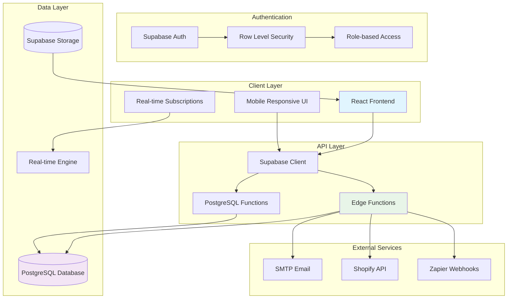
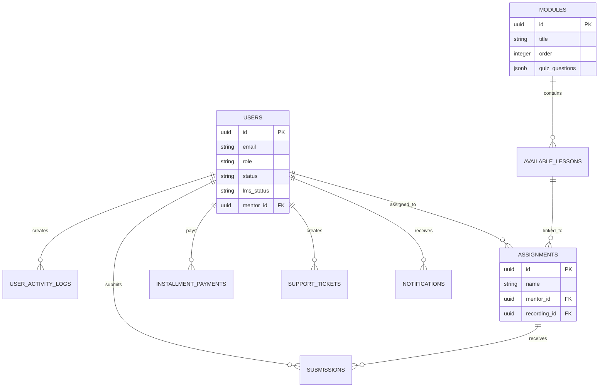
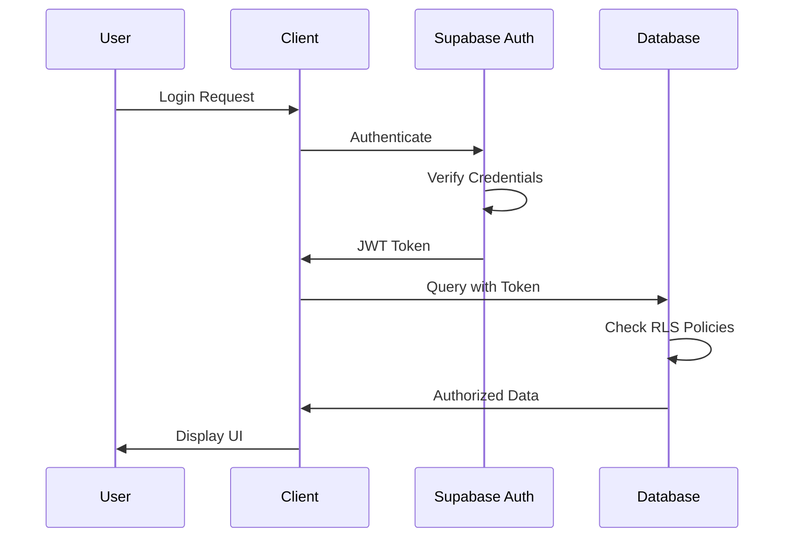
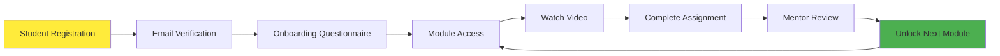
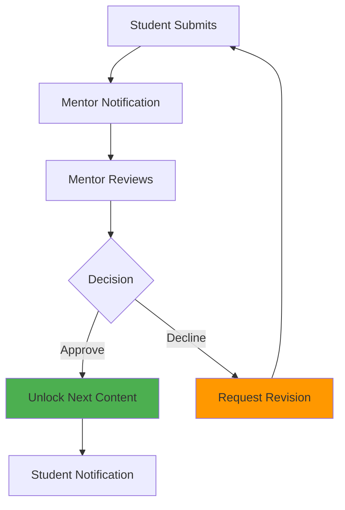
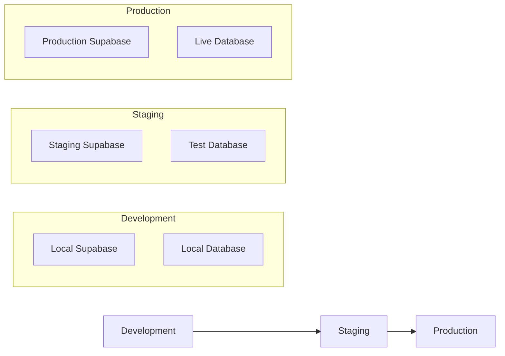

# Growth OS Architecture

## System Overview

Growth OS follows a modern web application architecture with a React frontend, Supabase backend, and microservices pattern using Edge Functions for business logic.

## Core Components

### Frontend Architecture

**Technology Stack:**
- React 18 with TypeScript
- Tailwind CSS for styling
- shadcn/ui component library
- React Router for navigation
- TanStack Query for data fetching

**Key Patterns:**
- Component-based architecture
- Custom hooks for business logic
- Context providers for global state
- Error boundaries for fault tolerance
- Responsive design with mobile-first approach

### Backend Architecture

**Supabase Services:**
- PostgreSQL database with Row Level Security (RLS)
- Authentication with JWT tokens
- Storage for file uploads
- Edge Functions for serverless logic
- Real-time subscriptions

**Database Design:**

### Edge Functions Architecture

**Function Categories:**

1. **User Management** ✅ Production Ready
   - `create-student-v2` - Student onboarding with email automation
   - `create-enhanced-student` - Advanced student creation with integrations
   - `create-team-member` - Admin/mentor account creation
   - `delete-user-with-role` - Secure user deletion with audit trails
   - `secure-user-creation` - Enhanced security for user provisioning

2. **Business Logic** ✅ Production Ready
   - `cleanup-inactive-students` - Automated data cleanup
   - `mark-invoice-paid` - Payment processing and LMS unlock
   - `motivational-notifications` - Automated student engagement
   - `installment-reminder-scheduler` - Payment reminders
   - `success-partner-credits` - Credit management system

3. **Email & Notifications** ✅ Production Ready
   - `process-email-queue` - Email delivery processing
   - `notification-scheduler` - Scheduled notification delivery
   - ⚠️ **Note**: Email system requires production SMTP verification

4. **Integrations** 🚧 Partial Implementation
   - `shopify-metrics` - E-commerce data sync (✅ Implemented)
   - `sync-shopify-metrics` - Automated metric synchronization (✅ Implemented)
   - `validate-shopify` - Shopify credential validation (✅ Implemented)
   - `meta-ads-metrics` - Facebook ads integration (⚠️ Requires API key)
   - `encrypt-token` - Security utilities (✅ Implemented)

5. **Onboarding & Processing** ✅ Production Ready
   - `process-onboarding-jobs` - Async onboarding processing
   - Background job queue system for heavy operations

**Edge Function Security**:
- All functions use Supabase service role for database access
- Input validation using TypeScript types
- ⚠️ **Issue**: Some functions lack Zod schema validation (recommended before launch)
- Error handling with proper HTTP status codes
- Audit logging for sensitive operations

### Security Architecture

**Authentication Flow:**

**Row Level Security (RLS) Policies:**
- Table-level access control
- Role-based data filtering
- User-specific data isolation
- Administrative override capabilities

## Data Flow Patterns

### Student Learning Journey

### Assignment Workflow

## Scalability Considerations

### Performance Optimizations

- **Database**: Indexed queries, materialized views for reports
- **Frontend**: Code splitting, lazy loading, React Query caching
- **Storage**: CDN delivery for static assets
- **Real-time**: Selective subscriptions, connection pooling

### Monitoring & Observability

- **Logging**: Structured logging with log levels
- **Error Tracking**: Error boundaries with detailed error reporting
- **Performance**: Database query monitoring
- **User Activity**: Comprehensive audit trails

## Deployment Architecture

### Environment Separation

### CI/CD Pipeline

1. **Code Push** → GitHub repository
2. **Automatic Deploy** → Platform deployment
3. **Database Migrations** → Supabase CLI
4. **Edge Functions** → Automatic deployment
5. **Static Assets** → CDN distribution

## Integration Points

### External Service Connections

- **Email Service**: SMTP configuration for transactional emails
- **E-commerce**: Shopify API for sales data
- **Automation**: Zapier webhooks for workflow integration
- **File Storage**: Supabase Storage for uploads

### API Design Patterns

- **RESTful**: Standard CRUD operations via Supabase
- **GraphQL-like**: Supabase PostgREST for complex queries
- **Real-time**: WebSocket connections for live updates
- **Edge Functions**: Serverless functions for business logic

## Security Architecture

### ⚠️ Known Security Issues

**CRITICAL WARNING**: The system has several critical security vulnerabilities that MUST be addressed before public launch. See [Security Issues Document](./SECURITY_ISSUES.md) for complete details.

**Summary of Critical Issues**:
1. Password hash exposure via RLS policy (enrollment managers can view passwords)
2. Missing RLS policies on `user_security_summary` table
3. Hardcoded Supabase credentials in source code (`src/lib/env-config.ts`)
4. 253 console.log statements exposing sensitive data
5. Insecure localStorage usage vulnerable to XSS

**Status**: 🔴 **NOT READY FOR PUBLIC LAUNCH**

### Security Best Practices

**Authentication Security**:
- JWT tokens with automatic refresh
- Role-based access control (RBAC)
- Session timeout and revocation
- Multi-factor authentication (planned)

**Database Security**:
- Row Level Security (RLS) on all user tables
- Security Definer functions for privileged operations
- Prepared statements to prevent SQL injection
- Audit logging for all sensitive operations

**API Security**:
- CORS configuration for allowed origins
- Rate limiting on all endpoints
- Input validation using Zod schemas
- API key rotation procedures

**Data Protection**:
- Encryption at rest (Supabase Storage)
- Encryption in transit (TLS/HTTPS)
- PII data anonymization for analytics
- GDPR compliance measures

### Security Monitoring

**Logging & Auditing**:
- All admin actions logged to `admin_logs` table
- User activity tracked in `user_activity_logs`
- Failed authentication attempts monitored
- Suspicious activity alerts (planned)

**Vulnerability Management**:
- Regular Supabase linter checks
- Dependency vulnerability scanning
- Security patch management
- Annual penetration testing (recommended)

## Error Handling Strategy

### Client-Side Error Handling

- React Error Boundaries for component failures
- Toast notifications for user feedback
- Retry mechanisms for network failures
- Fallback UI components for graceful degradation
- **⚠️ Issue**: 253 console.log statements need removal before production

### Server-Side Error Handling

- Database transaction rollbacks
- Edge Function error responses with proper status codes
- Audit logging for debugging (without sensitive data exposure)
- Automatic retry for transient failures with exponential backoff

## Next Steps

Review the [Environment Reference](./env-reference.md) for configuration details, then explore specific [Feature Documentation](./features/) to understand individual system components.