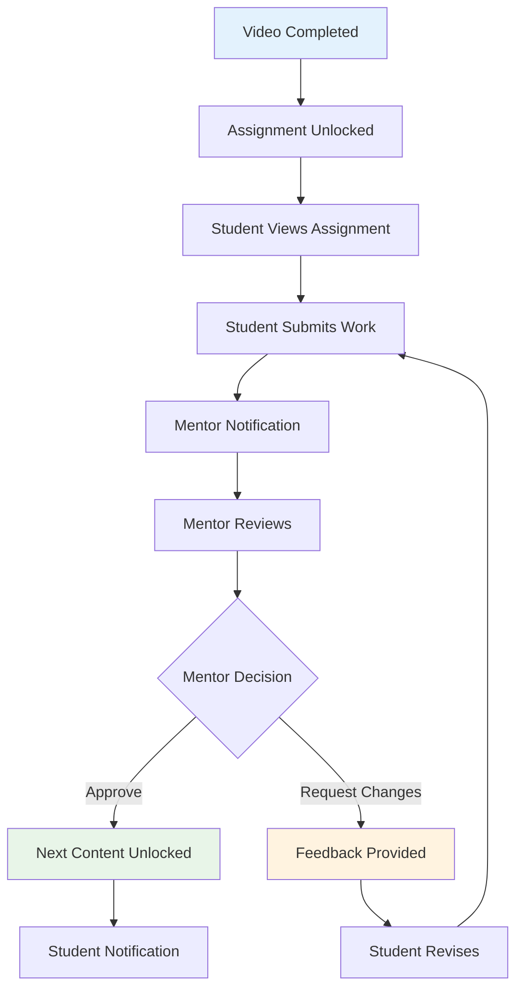

# Assignment System

## Overview

The assignment system provides structured assessment and feedback mechanisms where students submit work for mentor review, receive personalized feedback, and unlock subsequent content based on assignment approval.

## Assignment Workflow



## Core Features

### 1. Assignment Creation & Management

**Assignment Structure:**
- **Name**: Assignment title and identifier
- **Description**: Detailed instructions and requirements
- **Instructions**: Step-by-step guidance for students
- **Submission Type**: Text, file upload, or URL submission
- **Due Days**: Number of days after unlock for completion
- **Mentor Assignment**: Specific mentor for review
- **Recording Link**: Associated video lesson

**Code Entry Points:**
- `src/components/assignments/AssignmentManagement.tsx` - Admin assignment CRUD
- `src/components/assignments/SubmissionsManagement.tsx` - Submission review interface
- `src/pages/Assignments.tsx` - Student assignment interface

**Database Schema:**
```sql
CREATE TABLE assignments (
  id UUID PRIMARY KEY DEFAULT gen_random_uuid(),
  name TEXT NOT NULL,
  description TEXT,
  instructions TEXT,
  submission_type TEXT DEFAULT 'text',
  due_days INTEGER DEFAULT 7,
  mentor_id UUID REFERENCES users(id),
  recording_id UUID REFERENCES available_lessons(id),
  created_at TIMESTAMPTZ DEFAULT now()
);
```

### 2. Submission Management

**Submission Types:**

**Text Submissions:**
- Rich text editor for formatted responses
- Character/word count tracking
- Auto-save functionality
- Version history tracking

**File Submissions:**
- PDF, DOC, DOCX, TXT support
- Maximum file size: 10MB
- Virus scanning (future enhancement)
- Preview capabilities

**URL Submissions:**
- Link validation
- Website preview/screenshot
- Link accessibility checking
- External content tracking

**Database Schema:**
```sql
CREATE TABLE submissions (
  id UUID PRIMARY KEY DEFAULT gen_random_uuid(),
  assignment_id UUID NOT NULL REFERENCES assignments(id),
  student_id UUID NOT NULL REFERENCES users(id),
  content TEXT NOT NULL,
  status TEXT DEFAULT 'pending',
  notes TEXT, -- Mentor feedback
  created_at TIMESTAMPTZ DEFAULT now(),
  updated_at TIMESTAMPTZ DEFAULT now()
);
```

### 3. Review & Feedback System

**Review Process:**
1. **Notification**: Mentor receives submission alert
2. **Review**: Mentor evaluates student work
3. **Feedback**: Detailed comments and suggestions
4. **Decision**: Approve, decline, or request revision
5. **Notification**: Student receives feedback and decision

**Status Types:**
- `pending`: Awaiting mentor review
- `approved`: Accepted, unlocks next content
- `declined`: Rejected, requires resubmission
- `revision_requested`: Specific changes needed

**Feedback Features:**
- Rich text feedback with formatting
- Inline comments on submission content
- Rubric-based evaluation (future enhancement)
- Audio/video feedback (future enhancement)

### 4. Content Unlocking Integration

**Unlock Trigger:**
```typescript
// Assignment approval triggers content unlock
const handleSubmissionApproval = async (submissionId: string) => {
  // Update submission status
  await supabase
    .from('submissions')
    .update({ status: 'approved' })
    .eq('id', submissionId);
  
  // Trigger unlock function
  await supabase.rpc('unlock_next_recording', {
    p_student_id: studentId,
    p_current_recording_id: recordingId
  });
};
```

**Database Trigger:**
```sql
-- Automatically unlock next content on approval
CREATE OR REPLACE FUNCTION handle_submission_approval()
RETURNS TRIGGER AS $$
BEGIN
  IF NEW.status = 'approved' AND OLD.status != 'approved' THEN
    PERFORM unlock_next_recording(NEW.student_id, assignment_recording_id);
  END IF;
  RETURN NEW;
END;
$$ LANGUAGE plpgsql;
```

## Student Experience

### Assignment Discovery

**Assignment Access:**
- Assignments unlock after completing associated video
- Visual indicators show assignment status (locked/available/completed)
- Due date countdown for time management
- Progress indicators within assignment flow

**Assignment Interface:**
```typescript
const AssignmentInterface = () => {
  const [submission, setSubmission] = useState('');
  const [files, setFiles] = useState<File[]>([]);
  
  const handleSubmit = async () => {
    await supabase.from('submissions').insert({
      assignment_id: assignmentId,
      student_id: user.id,
      content: submission,
      status: 'pending'
    });
    
    // Trigger mentor notification
    await notifyMentor(assignmentId, user.full_name);
  };
};
```

### Submission Process

**Step-by-Step Flow:**
1. **Read Instructions**: Detailed assignment requirements
2. **Prepare Submission**: Work on assignment offline/online
3. **Submit Work**: Upload files or enter text response
4. **Confirmation**: Receive submission confirmation
5. **Wait for Review**: Tracking submission status
6. **Receive Feedback**: Mentor comments and decision
7. **Resubmit** (if needed): Address feedback and resubmit

### Progress Tracking

**Student Dashboard Elements:**
- Pending submissions count
- Overdue assignments alerts
- Recent feedback received
- Next assignment preview
- Completion percentage

## Mentor Experience

### Assignment Review Interface

**Review Dashboard:**
- **Pending Queue**: All submissions awaiting review
- **Student Filter**: View submissions by specific student
- **Assignment Type**: Filter by assignment category
- **Due Date Sorting**: Prioritize by submission deadlines
- **Batch Operations**: Approve/decline multiple submissions

**Review Features:**
```typescript
const SubmissionReview = ({ submission }) => {
  const [feedback, setFeedback] = useState('');
  const [decision, setDecision] = useState<'approved' | 'declined'>('approved');
  
  const handleReview = async () => {
    await supabase.from('submissions').update({
      status: decision,
      notes: feedback,
      updated_at: new Date().toISOString()
    }).eq('id', submission.id);
    
    // Send notification to student
    await notifyStudent(submission.student_id, decision, feedback);
  };
};
```

### Mentorship Tools

**Advanced Review Features:**
- **Rubric Evaluation**: Standardized scoring criteria
- **Comment Templates**: Pre-written feedback snippets
- **Voice Notes**: Audio feedback recording
- **Screen Recording**: Video explanations
- **Collaborative Review**: Multiple mentor input

**Student Progress Tracking:**
- Individual student submission history
- Performance trends over time
- Strengths and improvement areas
- Completion rate analytics

## Configuration Matrix

### Environment Variables

No specific environment variables required. Uses Supabase configuration for file storage and notifications.

### Dashboard Settings

**Assignment Configuration:**
- **Default Due Days**: 7 days (configurable per assignment)
- **Submission Types**: Text, File, URL (selectable per assignment)
- **Auto-Approval**: Disabled (all assignments require mentor review)
- **Resubmission Limit**: Unlimited (configurable)

**File Upload Settings:**
- **Max File Size**: 10MB per submission
- **Allowed Types**: PDF, DOC, DOCX, TXT, JPG, PNG
- **Storage Location**: Supabase Storage bucket `assignment-files`
- **Virus Scanning**: Not implemented (future enhancement)

### Hard-coded Defaults

**Submission Configuration:**
```typescript
const SUBMISSION_DEFAULTS = {
  STATUS: 'pending',
  DUE_DAYS: 7,
  SUBMISSION_TYPE: 'text',
  MAX_FILE_SIZE: 10 * 1024 * 1024, // 10MB
  RESUBMISSION_ALLOWED: true
};
```

**Notification Settings:**
```typescript
const NOTIFICATION_CONFIG = {
  MENTOR_IMMEDIATE: true, // Notify mentors immediately on submission
  STUDENT_FEEDBACK: true, // Notify students when feedback provided
  OVERDUE_REMINDERS: true, // Send overdue assignment reminders
  DUE_DATE_WARNINGS: 24 // Hours before due date to send warning
};
```

## Advanced Features

### 1. Rubric-Based Assessment

**Rubric Structure:**
```json
{
  "criteria": [
    {
      "name": "Content Quality",
      "weight": 40,
      "levels": [
        {"score": 4, "description": "Excellent understanding demonstrated"},
        {"score": 3, "description": "Good understanding with minor gaps"},
        {"score": 2, "description": "Basic understanding shown"},
        {"score": 1, "description": "Limited understanding evident"}
      ]
    }
  ]
}
```

**Benefits:**
- Consistent grading standards
- Detailed feedback breakdown
- Objective assessment criteria
- Progress tracking by skill area

### 2. Plagiarism Detection

**Implementation Options:**
- Text similarity analysis
- External API integration (Turnitin, Copyscape)
- Previous submission comparison
- Internet content checking

### 3. Collaborative Assignments

**Group Project Features:**
- Team formation tools
- Shared submission workspace
- Individual contribution tracking
- Peer evaluation system

**Implementation Considerations:**
- Group progress synchronization
- Individual vs. group grading
- Communication tools integration
- Conflict resolution mechanisms

## Notification System Integration

### Mentor Notifications

**Notification Triggers:**
- New submission received
- Overdue assignment alerts
- Student resubmission
- Assignment deadline approaching

**Notification Methods:**
- In-app notifications
- Email alerts
- SMS reminders (future)
- Dashboard badges

### Student Notifications

**Notification Types:**
- Assignment unlocked
- Feedback received
- Resubmission required
- Due date reminders
- Approval confirmation

**Code Implementation:**
```typescript
const notifySubmissionStatus = async (
  studentId: string, 
  assignmentTitle: string, 
  status: string,
  feedback?: string
) => {
  await supabase.functions.invoke('create-notification', {
    body: {
      user_id: studentId,
      type: 'assignment_feedback',
      title: `Assignment "${assignmentTitle}" ${status}`,
      message: feedback || `Your assignment has been ${status}`,
      metadata: { assignment_title: assignmentTitle, status }
    }
  });
};
```

## Security Considerations

### File Upload Security

**Security Measures:**
- File type validation
- Size limit enforcement
- Malware scanning (future)
- Sandboxed file viewing
- Access control per submission

**File Storage:**
```typescript
const uploadSubmissionFile = async (file: File, submissionId: string) => {
  const fileName = `${submissionId}/${Date.now()}-${file.name}`;
  
  const { data, error } = await supabase.storage
    .from('assignment-files')
    .upload(fileName, file, {
      cacheControl: '3600',
      upsert: false
    });
  
  if (error) throw error;
  return data.path;
};
```

### Data Privacy

**Access Control:**
- Students can only view their own submissions
- Mentors can only view assigned students' work
- Admins can view all submissions
- Audit trails for all access

**Row Level Security:**
```sql
-- Students can only view their own submissions
CREATE POLICY "students_own_submissions" ON submissions
FOR SELECT USING (auth.uid() = student_id);

-- Mentors can view submissions for their assignments
CREATE POLICY "mentors_assigned_submissions" ON submissions
FOR SELECT USING (
  EXISTS (
    SELECT 1 FROM assignments a
    WHERE a.id = submissions.assignment_id
    AND a.mentor_id = auth.uid()
  )
);
```

## Analytics & Reporting

### Assignment Performance

**Metrics Tracked:**
- Submission rates by assignment
- Average time to completion
- Approval/rejection rates
- Resubmission frequency
- Mentor feedback quality

**Performance Dashboard:**
```sql
-- Assignment completion analytics
CREATE VIEW assignment_analytics AS
SELECT 
  a.name as assignment_name,
  COUNT(s.id) as total_submissions,
  COUNT(CASE WHEN s.status = 'approved' THEN 1 END) as approved_count,
  AVG(EXTRACT(EPOCH FROM (s.updated_at - s.created_at))/3600) as avg_review_hours
FROM assignments a
LEFT JOIN submissions s ON a.id = s.assignment_id
GROUP BY a.id, a.name;
```

### Student Progress

**Individual Analytics:**
- Assignment completion rate
- Average submission quality
- Time management patterns
- Improvement trends over time
- Mentor feedback themes

### Mentor Effectiveness

**Review Quality Metrics:**
- Average review time
- Feedback detail level
- Student satisfaction scores
- Consistency in grading
- Response time patterns

## Failure Modes

### Submission Failures

**Common Issues:**
- File upload timeouts
- Network connectivity problems
- File size/type restrictions
- Browser compatibility issues

**Recovery Mechanisms:**
- Auto-save functionality
- Resume upload capability
- Multiple upload attempts
- Alternative submission methods

### Review Bottlenecks

**Potential Problems:**
- Mentor overload
- Extended review times
- Inconsistent feedback quality
- Communication gaps

**Mitigation Strategies:**
- Load balancing among mentors
- Review time targets
- Feedback templates
- Escalation procedures

## Extension Guidelines

### Custom Assignment Types

**Implementation Steps:**
1. **Define Assignment Type**: Create new submission type
2. **Update Database**: Add type-specific fields
3. **Create UI Components**: Custom submission interface
4. **Implement Validation**: Type-specific validation rules
5. **Update Review Interface**: Custom review components

**Example - Code Assignment:**
```sql
-- Add code assignment support
ALTER TABLE assignments ADD COLUMN assignment_type TEXT DEFAULT 'general';
ALTER TABLE submissions ADD COLUMN code_language TEXT;
ALTER TABLE submissions ADD COLUMN code_repository_url TEXT;
```

### Integration with External Tools

**Code Review Platforms:**
- GitHub integration for code submissions
- GitLab merge request reviews
- Automated testing integration
- Code quality analysis

**Design Tools:**
- Figma/Sketch file integration
- Adobe Creative Cloud connectivity
- Portfolio submission platforms
- Design feedback tools

### AI-Powered Features

**Automated Assessment:**
- Basic grammar/spelling checking
- Plagiarism detection
- Content relevance scoring
- Preliminary feedback generation

**Implementation Considerations:**
- Human oversight requirements
- Accuracy thresholds
- Bias detection and mitigation
- Student privacy protection

## Troubleshooting

### Common Issues

**1. Assignment Not Unlocking**
```sql
-- Check video completion status
SELECT * FROM recording_views 
WHERE user_id = 'student-uuid' AND recording_id = 'video-uuid';

-- Verify assignment prerequisites
SELECT * FROM assignments 
WHERE recording_id = 'video-uuid';
```

**2. Submission Upload Failures**
```typescript
// Client-side debugging
console.log('File size:', file.size, 'Max allowed:', MAX_FILE_SIZE);
console.log('File type:', file.type, 'Allowed types:', ALLOWED_TYPES);

// Check Supabase Storage permissions
const { data, error } = await supabase.storage
  .from('assignment-files')
  .list('');
console.log('Storage access:', { data, error });
```

**3. Notification Delivery Issues**
```sql
-- Check notification creation
SELECT * FROM notifications 
WHERE user_id = 'user-uuid' 
ORDER BY sent_at DESC LIMIT 10;

-- Verify email delivery status
SELECT * FROM messages 
WHERE user_id = 'user-uuid' 
ORDER BY sent_at DESC LIMIT 10;
```

### Performance Optimization

**Database Optimization:**
```sql
-- Add indexes for better query performance
CREATE INDEX idx_submissions_student_assignment ON submissions(student_id, assignment_id);
CREATE INDEX idx_submissions_status ON submissions(status);
CREATE INDEX idx_assignments_mentor ON assignments(mentor_id);
```

**File Upload Optimization:**
- Implement chunked uploads for large files
- Add progress indicators for user feedback
- Enable compression for text-based files
- Implement client-side validation

## Next Steps

The assignment system integrates closely with [Mentorship Program](./mentorship-program.md) features, which provide the human element essential for effective assignment review and student guidance.