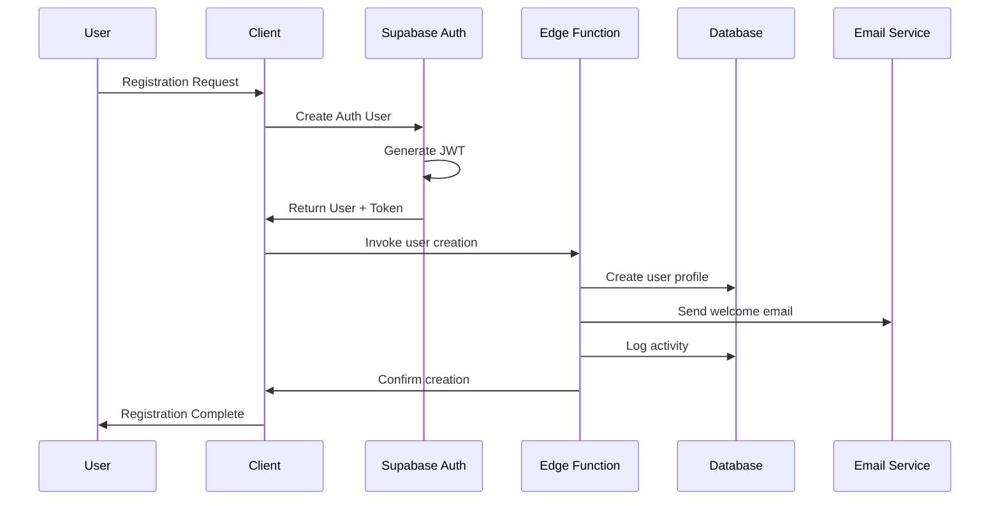
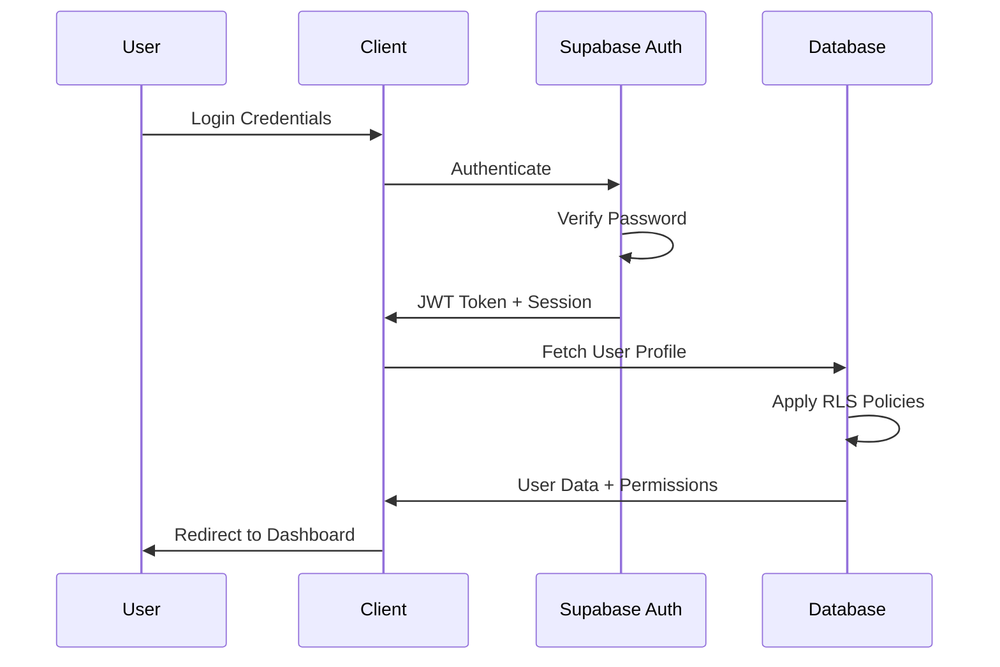

# Authentication System

## Overview

Growth OS implements a comprehensive role-based authentication system using Supabase Auth with 5 distinct user roles and granular permissions. The system provides secure session management, automated onboarding, and fine-grained access control.

## User Roles & Permissions

### 1. Student Role
**Purpose**: End users who consume learning content

**Capabilities:**
- Access assigned modules and videos
- Submit assignments and view feedback
- Participate in live sessions
- View personal progress and certificates
- Create support tickets
- Manage personal profile

**Restrictions:**
- Cannot access other students' data
- Cannot modify course content
- Cannot access administrative functions

### 2. Mentor Role
**Purpose**: Instructors who guide and evaluate students

**Capabilities:**
- View assigned students' progress
- Review and grade assignments
- Provide feedback and mentorship notes
- Schedule and host success sessions
- Access student performance analytics
- Manage own availability and calendar

**Access Scope:**
- Only students assigned to them
- All course content for reference
- Mentorship tools and analytics

### 3. Admin Role
**Purpose**: System administrators for day-to-day operations

**Capabilities:**
- Manage students, mentors, and enrollment managers
- Configure company settings and branding
- Process payments and invoices
- Access all reporting and analytics
- Manage support tickets
- Upload and organize course content

**Restrictions:**
- Cannot manage other admins
- Cannot access system-level settings
- Cannot delete critical system data

### 4. Superadmin Role
**Purpose**: Full system access and configuration

**Capabilities:**
- All admin capabilities plus:
- Manage admin accounts
- Configure system-wide settings
- Access debug and audit logs
- Manage integrations and API keys
- Perform database operations
- Configure email templates and automation

### 5. Enrollment Manager Role
**Purpose**: Specialized role for student onboarding and enrollment

**Capabilities:**
- Create and manage student accounts
- Process enrollment applications
- Track payment status and follow-ups
- Manage onboarding workflows
- View enrollment analytics
- Handle initial student support

## Authentication Flow

### Registration Process



### Login Process



## Implementation Details

### Code Entry Points

**Frontend Authentication:**
- `src/hooks/useAuth.ts` - Main authentication hook
- `src/components/RoleGuard.tsx` - Role-based route protection
- `src/pages/Login.tsx` - Login/registration interface

**Backend Authentication:**
- `supabase/functions/create-user-with-role/index.ts` - User creation
- `supabase/functions/whoami/index.ts` - User identity verification
- Database RLS policies for each table

### Session Management

**Session Configuration:**
```typescript
// src/integrations/supabase/client.ts
export const supabase = createClient<Database>(SUPABASE_URL, SUPABASE_PUBLISHABLE_KEY, {
  auth: {
    storage: localStorage,
    persistSession: true,
    autoRefreshToken: true,
  }
});
```

**Session Validation:**
- JWT tokens automatically refresh
- 1-hour token expiry (configurable)
- Persistent sessions across browser restarts
- Automatic logout on token expiration

### Row Level Security (RLS)

**Policy Examples:**

```sql
-- Students can only view their own data
CREATE POLICY "Students view own data" ON users
FOR SELECT USING (auth.uid() = id AND role = 'student');

-- Mentors can view assigned students
CREATE POLICY "Mentors view assigned students" ON users
FOR SELECT USING (
  role = 'student' AND mentor_id = auth.uid()
  OR auth.uid() = id
);

-- Admins can view all users except superadmins
CREATE POLICY "Admins manage users" ON users
FOR ALL USING (
  auth.uid() IN (
    SELECT id FROM users WHERE role IN ('admin', 'superadmin')
  )
);
```

## Configuration Matrix

### Environment Variables

| Variable | Purpose | Required | Default |
|----------|---------|----------|---------|
| `SUPABASE_URL` | Authentication service URL | Yes | - |
| `SUPABASE_ANON_KEY` | Public API key | Yes | - |
| JWT expiry | Token lifetime | No | 3600s |

### Dashboard Settings

**Supabase Auth Configuration:**
- Site URL: `https://majqoqagohicjigmsilu.lovable.app`
- Email confirmation: Disabled (for testing)
- Password requirements: 6+ characters
- Additional redirect URLs: `https://lovable.dev`

### Hard-coded Defaults

**Role Hierarchy (unchangeable):**
```typescript
const ROLE_HIERARCHY = {
  'student': 1,
  'enrollment_manager': 2,
  'mentor': 3,
  'admin': 4,
  'superadmin': 5
};
```

**Default Permissions:**
- Students: Read-only access to assigned content
- Mentors: Read/write access to assigned students
- Admins: Full access except user management
- Superadmins: Unrestricted access

## Security Considerations

### Password Security

- **Minimum length**: 6 characters (configurable in Supabase)
- **Complexity**: No special requirements (can be enhanced)
- **Reset mechanism**: Email-based password reset
- **Account lockout**: Not implemented (potential enhancement)

### Session Security

- **Token storage**: localStorage (secure for SPA)
- **Auto-refresh**: Prevents session expiration
- **Secure cookies**: Not applicable (JWT tokens)
- **Cross-site protection**: Built into Supabase Auth

### API Security

- **Rate limiting**: Supabase built-in protection
- **SQL injection**: Prevented by Supabase client
- **XSS protection**: React built-in escaping
- **CSRF protection**: JWT tokens prevent CSRF

### Common Vulnerabilities

**Potential Issues:**
1. **Privilege escalation**: Role changes not immediately reflected
2. **Session fixation**: Tokens cached in memory
3. **Information disclosure**: Verbose error messages

**Mitigation Strategies:**
1. Implement role validation in Edge Functions
2. Clear client state on logout
3. Use generic error messages for auth failures

## Failure Modes

### Authentication Failures

**Login Issues:**
- Invalid credentials → User-friendly error message
- Account disabled → "Contact administrator" message
- Network errors → Retry mechanism with exponential backoff

**Session Issues:**
- Token expiry → Automatic refresh or redirect to login
- Storage unavailable → Graceful degradation to session-only auth
- Network connectivity → Offline mode with limited functionality

### Recovery Procedures

**Password Reset:**
```typescript
// Trigger password reset email
const { error } = await supabase.auth.resetPasswordForEmail(email, {
  redirectTo: `${window.location.origin}/reset-password`,
});
```

**Account Recovery:**
- Email-based verification link
- Manual admin intervention for locked accounts
- Backup authentication via admin panel

## Extension Guidelines

### Adding New Roles

1. **Update role enum** in database:
   ```sql
   ALTER TYPE user_role ADD VALUE 'new_role';
   ```

2. **Create RLS policies** for new role:
   ```sql
   CREATE POLICY "new_role_policy" ON table_name
   FOR operation USING (role_condition);
   ```

3. **Update frontend guards**:
   ```typescript
   <RoleGuard allowedRoles={['new_role', 'admin']}>
     <NewRoleComponent />
   </RoleGuard>
   ```

### Custom Authentication Methods

**OAuth Integration:**
1. Configure provider in Supabase Dashboard
2. Add OAuth buttons to login form
3. Handle OAuth callback and user creation
4. Map OAuth user data to Growth OS profile

**SSO Integration:**
1. Configure SAML/OIDC in Supabase
2. Implement custom authentication flow
3. Map SSO attributes to user roles
4. Handle account linking and migration

### Enhanced Security Features

**Two-Factor Authentication:**
- Implement using Supabase MFA
- Require for admin and superadmin roles
- SMS or authenticator app options
- Backup codes for recovery

**Audit Logging:**
- Enhanced login/logout tracking
- Failed authentication attempt monitoring
- Privilege escalation alerts
- Suspicious activity detection

## Troubleshooting

### Common Issues

**1. Login Failures**
```typescript
// Debug authentication state
const { data: session, error } = await supabase.auth.getSession();
console.log('Session:', session, 'Error:', error);
```

**2. Permission Denied Errors**
```sql
-- Check user role and permissions
SELECT role, lms_status FROM users WHERE id = auth.uid();
```

**3. Session Persistence Issues**
```typescript
// Clear and re-initialize auth state
localStorage.clear();
window.location.reload();
```

### Debug Commands

```bash
# Test authentication endpoint
curl -X POST "https://majqoqagohicjigmsilu.supabase.co/auth/v1/token" \
  -H "Content-Type: application/json" \
  -d '{"email":"test@example.com","password":"password"}'

# Verify Edge Function access
curl -X POST "https://majqoqagohicjigmsilu.supabase.co/functions/v1/whoami" \
  -H "Authorization: Bearer <jwt-token>"
```

## Next Steps

Configure user roles and permissions, then proceed to [Student Management](./student-management.md) to understand the complete user lifecycle.