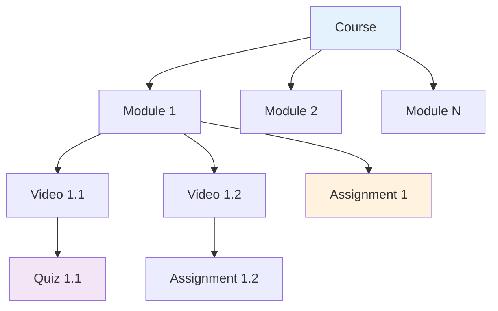
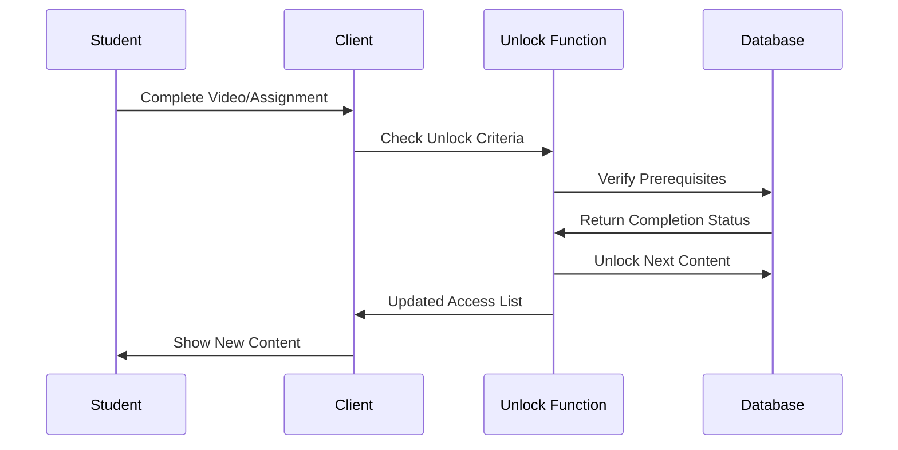

# Learning Management System

## Overview

The Learning Management System (LMS) provides structured content delivery with sequential unlocking, progress tracking, and adaptive learning paths. Students progress through modules by completing assignments and meeting prerequisites.

## Content Structure



## Core Features

### 1. Module Management

**Module Structure:**
- **Title**: Descriptive module name
- **Description**: Learning objectives and overview
- **Order**: Sequential progression (1, 2, 3...)
- **Quiz Questions**: Optional module assessments
- **Prerequisites**: Required prior completions

**Code Entry Points:**
- `src/components/superadmin/ModulesManagement.tsx` - Module CRUD operations
- `src/components/ModuleCard.tsx` - Student module display
- `src/hooks/useModulesWithRecordings.ts` - Module data fetching

**Database Schema:**
```sql
CREATE TABLE modules (
  id UUID PRIMARY KEY DEFAULT gen_random_uuid(),
  title TEXT NOT NULL,
  description TEXT,
  order INTEGER,
  quiz_questions JSONB,
  tenant_id UUID,
  created_at TIMESTAMPTZ DEFAULT now()
);
```

### 2. Video/Recording Management

**Recording Structure:**
- **Title**: Video lesson name
- **URL**: Video file location or stream URL
- **Duration**: Length in minutes
- **Sequence Order**: Unlock progression within module
- **Module Assignment**: Parent module relationship
- **Upload Metadata**: Uploader and timestamp

**Sequential Unlocking Logic:**
```typescript
// Students can only access videos in sequence
const isVideoUnlocked = (videoId: string, userProgress: Progress[]) => {
  const video = getVideoById(videoId);
  const previousVideos = getVideosBeforeSequence(video.sequence_order);
  
  return previousVideos.every(prevVideo => 
    userProgress.some(p => p.recording_id === prevVideo.id && p.watched)
  );
};
```

**Code Entry Points:**
- `src/components/superadmin/RecordingsManagement.tsx` - Video upload and management
- `src/components/LessonRow.tsx` - Individual video display and interaction
- `src/hooks/useStudentRecordings.ts` - Student video access logic

### 3. Progress Tracking System

**Progress Metrics:**
- **Video Completion**: Tracked per recording
- **Module Completion**: All videos + assignments completed
- **Quiz Scores**: Performance on module assessments
- **Time Spent**: Learning engagement metrics
- **Unlock Status**: Content accessibility tracking

**Progress Data Structure:**
```typescript
interface UserProgress {
  user_id: string;
  module_id: string;
  recording_id?: string;
  is_completed: boolean;
  completed_at?: Date;
  time_spent_minutes?: number;
  quiz_score?: number;
}
```

**Implementation:**
```typescript
// Mark video as watched
const markVideoWatched = async (recordingId: string) => {
  await supabase.from('recording_views').upsert({
    user_id: user.id,
    recording_id: recordingId,
    watched: true,
    watched_at: new Date().toISOString()
  });
  
  // Check if this unlocks next content
  await checkAndUnlockNext(recordingId);
};
```

### 4. Content Unlocking System

**Unlock Logic Flow:**


**Unlock Criteria:**
1. **Sequential Videos**: Previous video watched + assignment passed
2. **Module Progression**: All module content completed
3. **Assignment Gates**: Assignment approval required
4. **Quiz Thresholds**: Minimum score requirements

**Database Functions:**
```sql
-- Get student unlock sequence
CREATE OR REPLACE FUNCTION get_student_unlock_sequence(p_user_id UUID)
RETURNS TABLE(recording_id UUID, sequence_order INTEGER, is_unlocked BOOLEAN, unlock_reason TEXT);

-- Initialize new student unlocks (first video only)
CREATE OR REPLACE FUNCTION initialize_student_unlocks(p_student_id UUID);
```

## Content Types

### 1. Video Lessons

**Video Configuration:**
- **Storage**: Supabase Storage or external CDN
- **Formats**: MP4, WebM (browser compatibility)
- **Quality**: Multiple resolutions (future enhancement)
- **Streaming**: Direct URL or embedded player

**Student Experience:**
- Automatic progress tracking
- Resume from last position (future enhancement)
- Playback speed controls
- Download for offline viewing (configurable)

### 2. Module Quizzes

**Quiz Structure:**
```json
{
  "questions": [
    {
      "id": "q1",
      "question_text": "What is the key to successful e-commerce?",
      "options": ["Price", "Quality", "Marketing", "All of the above"],
      "correct_option": "All of the above",
      "explanation": "Success requires balancing all these factors."
    }
  ]
}
```

**Quiz Features:**
- Multiple choice questions
- Immediate feedback
- Unlimited attempts (configurable)
- Progress gate for module completion
- Performance analytics

### 3. Interactive Content

**Future Enhancements:**
- Document downloads (PDFs, worksheets)
- Interactive simulations
- Code exercises for technical content
- Virtual labs and sandboxes

## Configuration Matrix

### Environment Variables

No specific environment variables required for core LMS functionality. Uses Supabase configuration.

### Dashboard Settings

**Module Configuration:**
- **Sequential Unlocking**: Enabled by default
- **Quiz Requirements**: Optional per module
- **Assignment Gates**: Configurable per video
- **Progress Tracking**: Always enabled

**Content Upload Settings:**
- **Max File Size**: 500MB per video (Supabase Storage limit)
- **Allowed Formats**: MP4, WebM, MOV
- **Storage Location**: Supabase Storage bucket
- **CDN Integration**: External URL support

### Hard-coded Defaults

**Unlock Logic:**
```typescript
const UNLOCK_RULES = {
  FIRST_VIDEO_AUTO_UNLOCK: true,
  SEQUENTIAL_REQUIRED: true,
  ASSIGNMENT_COMPLETION_REQUIRED: true,
  QUIZ_PASSING_SCORE: 70 // percentage
};
```

**Progress Thresholds:**
```typescript
const COMPLETION_CRITERIA = {
  VIDEO_WATCH_PERCENTAGE: 90, // 90% viewed = completed
  MODULE_COMPLETION_THRESHOLD: 100, // All content must be completed
  QUIZ_ATTEMPTS_LIMIT: null // Unlimited attempts
};
```

## Student Learning Experience

### Dashboard View

**Learning Dashboard Components:**
- **Progress Overview**: Completion percentage and current module
- **Next Assignment**: Immediate next action required
- **Recent Activity**: Last videos watched and assignments submitted
- **Leaderboard**: Peer comparison and motivation

**Navigation Flow:**
1. Student logs in → Dashboard shows current progress
2. Click "Continue Learning" → Directed to next unlocked content
3. Complete video → Assignment unlocked (if exists)
4. Submit assignment → Next video unlocked after approval
5. Complete module → Next module becomes available

### Video Player Interface

**Player Features:**
- Full-screen support
- Playback controls (play, pause, seek)
- Volume control
- Playback speed (future enhancement)
- Progress indicator

**Progress Tracking:**
- Automatic progress saves every 30 seconds
- Completion triggered at 90% viewed
- Resume from last position on return
- Mobile-responsive player

### Assignment Integration

**Assignment Workflow within LMS:**
1. Student watches video content
2. Assignment becomes available/unlocked
3. Student completes and submits assignment
4. Mentor reviews and provides feedback
5. Upon approval, next content unlocks
6. Progress updates and notifications sent

## Advanced Features

### 1. Adaptive Learning Paths

**Future Enhancement:**
- **Skill-based Progression**: Unlock based on competency
- **Personalized Recommendations**: AI-suggested content
- **Learning Preferences**: Visual, auditory, kinesthetic paths
- **Difficulty Adjustment**: Content complexity adaptation

### 2. Offline Learning

**Implementation Considerations:**
- Video download for offline viewing
- Sync progress when reconnected
- Offline assignment completion
- Local storage management

### 3. Collaborative Learning

**Social Features:**
- Student discussion forums
- Peer review assignments
- Group projects and presentations
- Study groups and partnerships

## Analytics & Reporting

### Student Analytics

**Individual Metrics:**
- Learning velocity (modules per week)
- Engagement time per session
- Quiz performance trends
- Assignment submission patterns
- Video rewatch frequency

**Implementation:**
```sql
-- Student learning analytics view
CREATE VIEW student_learning_analytics AS
SELECT 
  u.id,
  u.full_name,
  COUNT(DISTINCT ump.module_id) as modules_completed,
  AVG(rv.time_spent_min) as avg_session_time,
  COUNT(rv.recording_id) as videos_watched
FROM users u
LEFT JOIN user_module_progress ump ON u.id = ump.user_id
LEFT JOIN recording_views rv ON u.id = rv.user_id
WHERE u.role = 'student'
GROUP BY u.id, u.full_name;
```

### Content Analytics

**Content Performance:**
- Video completion rates
- Most rewatched segments
- Assignment difficulty analysis
- Module progression bottlenecks
- Quiz question effectiveness

### System Analytics

**Usage Patterns:**
- Peak learning hours
- Device usage distribution
- Content consumption patterns
- Drop-off points identification
- Engagement correlation analysis

## Security Considerations

### Content Protection

**Access Control:**
- Video URLs are signed and time-limited
- Student-specific content visibility
- Download restrictions (configurable)
- Screenshot/recording prevention (future)

**Data Privacy:**
- Learning progress anonymization options
- GDPR compliance for student data
- Secure video storage and delivery
- Audit trails for content access

### Performance Security

**Rate Limiting:**
- Video streaming bandwidth limits
- Quiz attempt frequency controls
- Assignment submission limits
- API request throttling

## Failure Modes

### Content Delivery Failures

**Video Streaming Issues:**
- CDN fallback mechanisms
- Multiple video quality options
- Offline download capabilities
- Progressive loading for slow connections

**Recovery Actions:**
- Automatic retry logic
- Manual refresh options
- Alternative content formats
- Customer support escalation

### Progress Tracking Failures

**Data Consistency:**
- Progress synchronization checks
- Duplicate progress prevention
- Manual progress correction tools
- Audit trail reconciliation

## Extension Guidelines

### Adding New Content Types

**Implementation Steps:**
1. **Database Schema**: Add content type tables
2. **Upload Interface**: Admin content management UI
3. **Student Display**: Rendering components
4. **Progress Tracking**: Completion criteria
5. **Unlock Logic**: Integration with existing system

**Example - Document Content:**
```sql
-- Add document content type
CREATE TABLE documents (
  id UUID PRIMARY KEY DEFAULT gen_random_uuid(),
  title TEXT NOT NULL,
  file_url TEXT NOT NULL,
  module_id UUID REFERENCES modules(id),
  sequence_order INTEGER,
  download_allowed BOOLEAN DEFAULT true
);
```

### Custom Progress Metrics

**Advanced Tracking:**
- Time-based milestones
- Engagement quality scores
- Knowledge retention testing
- Skill competency mapping
- Learning style adaptation

### Integration with External LMS

**Standards Compliance:**
- SCORM package support
- xAPI (Tin Can API) integration
- LTI (Learning Tools Interoperability)
- QTI (Question & Test Interoperability)

## Troubleshooting

### Common Issues

**1. Content Not Unlocking**
```sql
-- Check unlock status for student
SELECT * FROM get_student_unlock_sequence('student-uuid');

-- Verify assignment completion
SELECT * FROM submissions WHERE student_id = 'student-uuid' AND status = 'approved';
```

**2. Progress Not Saving**
```sql
-- Check recording views
SELECT * FROM recording_views WHERE user_id = 'student-uuid' ORDER BY watched_at DESC;

-- Verify module progress
SELECT * FROM user_module_progress WHERE user_id = 'student-uuid';
```

**3. Video Playback Issues**
```typescript
// Client-side debugging
console.log('Video element:', videoElement);
console.log('Can play type:', videoElement.canPlayType('video/mp4'));
console.log('Network state:', videoElement.networkState);
```

### Performance Optimization

**Database Queries:**
```sql
-- Add indexes for better performance
CREATE INDEX idx_recording_views_user_id ON recording_views(user_id);
CREATE INDEX idx_user_module_progress_user_id ON user_module_progress(user_id);
CREATE INDEX idx_available_lessons_sequence ON available_lessons(sequence_order);
```

**Caching Strategy:**
- Module data cached in React Query
- Video metadata preloaded
- Progress updates debounced
- Student unlock status cached

## Next Steps

Understanding the LMS structure prepares you for [Assignment System](./assignment-system.md) integration, which builds upon the content unlocking mechanisms.