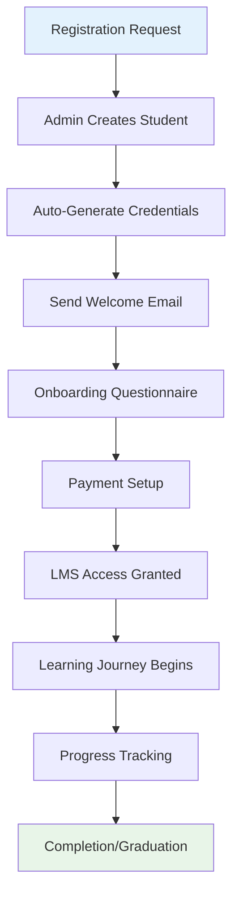

# Student Management System

## Overview

The student management system handles the complete student lifecycle from registration through graduation, including automated onboarding, LMS access control, progress tracking, and administrative oversight.

## Student Lifecycle



## Core Features

### 1. Student Creation & Onboarding

**Automated Student Creation Process:**

**Entry Point:** `src/components/admin/StudentManagement.tsx`
**Edge Function:** `supabase/functions/create-student/index.ts`

**Process Flow:**
1. Admin inputs student details (name, email, phone, installment plan)
2. System validates for duplicate email/phone
3. Generates unique student ID (format: STU000001)
4. Creates user account with randomly generated password
5. Triggers automated email sequence
6. Creates installment payment records
7. Logs all activities for audit trail

**Configuration:**
- **Student ID Format**: `STU` + 6-digit sequential number
- **Password Generation**: 12-character random string (letters + numbers)
- **Default Status**: "Active" with LMS status "inactive"
- **Email Templates**: Customizable via company settings

### 2. LMS Access Management

**Access Control System:**

**Implementation:** Row Level Security (RLS) policies
**Status Types:**
- `active`: Full LMS access
- `inactive`: No course access (default for new students)
- `suspended`: Temporary access revocation

**Access Granting Process:**
```sql
-- Enable LMS access
UPDATE users 
SET lms_status = 'active' 
WHERE id = 'student-uuid';

-- Suspend access
UPDATE users 
SET lms_status = 'suspended' 
WHERE id = 'student-uuid';
```

**Code Entry Points:**
- `src/components/admin/StudentManagement.tsx` - Access control UI
- `src/hooks/useAuth.ts` - Client-side access validation
- Database RLS policies enforce server-side access control

### 3. Student Information Management

**Profile Fields:**
- **Basic Info**: Full name, email, phone number
- **Academic**: Student ID, enrollment date, status
- **Financial**: Fee structure, installment plan, payment status
- **Learning**: Progress tracking, mentor assignment
- **System**: LMS status, last login, account creation date

**Editable by Role:**
- **Students**: Personal information only
- **Mentors**: Progress notes and assessments
- **Admins**: All fields except system-generated data
- **Superadmins**: All fields including system data

### 4. Bulk Operations

**Mass Student Management:**

**Supported Operations:**
- Bulk status updates (Active/Suspended)
- Mass LMS access changes
- Batch payment status updates
- Group email communications

**Implementation:**
```typescript
// Bulk status update
const updateMultipleStudents = async (studentIds: string[], status: string) => {
  const { error } = await supabase
    .from('users')
    .update({ status })
    .in('id', studentIds);
};
```

## Configuration Matrix

### Environment Variables

| Variable | Purpose | Impact | Default |
|----------|---------|--------|---------|
| `SMTP_LMS_FROM_EMAIL` | Student email sender | Onboarding emails | `lms@company.com` |
| `SMTP_LMS_FROM_NAME` | Sender display name | Email branding | "LMS Team" |

### Dashboard Settings

**Company Settings → Student Management:**
- **Maximum Installments**: 3 (configurable 1-12)
- **Default Fee Amount**: $3000 (customizable)
- **Auto-enrollment**: Enabled/Disabled
- **Onboarding Questionnaire**: Custom questions in JSON format

### Hard-coded Defaults

**Student Creation:**
```typescript
// Default values for new students
const DEFAULT_STUDENT = {
  role: 'student',
  status: 'Active',
  lms_status: 'inactive',
  onboarding_done: false,
  fees_structure: '3_installments' // Based on selected plan
};
```

**Student ID Generation:**
```sql
-- Sequential ID generation
SELECT 'STU' || LPAD(
  (COALESCE(MAX(CAST(SUBSTRING(student_id FROM 4) AS INTEGER)), 0) + 1)::TEXT, 
  6, '0'
) FROM users WHERE role = 'student';
```

## Onboarding System

### Automated Email Sequence

**Email Types:**
1. **Welcome Email**: Login credentials and platform overview
2. **Onboarding Email**: Questionnaire link and next steps
3. **Payment Reminder**: Payment instructions and deadline
4. **LMS Access**: Course access notification

**Email Jobs System:**
- **Table**: `student_onboarding_jobs`
- **Job Types**: EMAIL, INVOICE
- **Retry Logic**: Exponential backoff (1h, 2h, 4h, 8h, 24h)
- **Status Tracking**: PENDING, PROCESSING, COMPLETED, FAILED

### Onboarding Questionnaire

**Configuration:**
```json
{
  "questions": [
    {
      "id": "q1",
      "text": "What is your previous e-commerce experience?",
      "answerType": "multiSelect",
      "options": ["Beginner", "Intermediate", "Advanced"],
      "order": 1
    }
  ]
}
```

**Answer Types Supported:**
- `singleLine`: Short text input
- `multiLine`: Long text area
- `singleSelect`: Radio buttons
- `multiSelect`: Checkboxes
- `file`: File upload

## Progress Tracking

### Learning Progress

**Tracking Metrics:**
- Modules completed
- Videos watched
- Assignments submitted
- Quiz scores
- Time spent learning

**Implementation:**
```typescript
// Track module completion
const markModuleComplete = async (userId: string, moduleId: string) => {
  await supabase.from('user_module_progress').upsert({
    user_id: userId,
    module_id: moduleId,
    is_completed: true,
    completed_at: new Date().toISOString()
  });
};
```

### Status Updates

**Automatic Status Changes:**
- **"Passed out / Completed"**: All modules completed
- **"Suspended"**: Payment overdue > 30 days
- **"Inactive"**: No activity > 14 days

**Manual Status Management:**
- Admins can override automatic status
- Status changes trigger notifications
- Audit trail tracks all changes

## Security Considerations

### Data Protection

**Student PII Security:**
- Email addresses encrypted in database
- Phone numbers masked in UI for non-admins
- Payment information separate from profile data
- Audit logs track all data access

**Access Controls:**
```sql
-- Students can only view their own data
CREATE POLICY "students_view_own" ON users
FOR SELECT USING (auth.uid() = id AND role = 'student');

-- Mentors can view assigned students
CREATE POLICY "mentors_view_assigned" ON users
FOR SELECT USING (
  mentor_id = auth.uid() 
  OR (role = 'mentor' AND auth.uid() = id)
);
```

### Account Security

**Password Management:**
- Auto-generated secure passwords
- Password reset via email only
- No password storage in plain text
- Failed login attempt monitoring

**Session Management:**
- JWT token expiration (1 hour)
- Automatic session refresh
- Device-based session tracking
- Suspicious activity alerts

## Failure Modes

### Onboarding Failures

**Email Delivery Issues:**
- SMTP configuration errors
- Invalid email addresses
- Rate limiting by email provider
- Bounce handling and retry logic

**Recovery Actions:**
- Manual email resend options
- Alternative contact methods
- Admin override capabilities
- Error logging and alerting

### Data Integrity Issues

**Duplicate Prevention:**
- Email uniqueness constraints
- Phone number validation
- Student ID collision detection
- Rollback mechanisms for failed operations

### System Performance

**Large Student Lists:**
- Pagination for admin views
- Lazy loading of student data
- Search and filtering optimization
- Database indexing on key fields

## Extension Guidelines

### Adding Custom Fields

**Database Schema:**
```sql
-- Add custom student fields
ALTER TABLE users ADD COLUMN custom_field TEXT;

-- Update RLS policies
CREATE POLICY "custom_field_access" ON users
FOR SELECT USING (/* role-based conditions */);
```

**Frontend Integration:**
```typescript
// Update student form
const StudentForm = () => {
  const [customField, setCustomField] = useState('');
  // ... form implementation
};
```

### Custom Onboarding Workflows

**Multi-step Onboarding:**
1. Create additional onboarding tables
2. Implement step-by-step progress tracking
3. Add conditional logic for different student types
4. Customize email sequences per workflow

**Integration Points:**
- Payment processor webhooks
- CRM system synchronization
- Marketing automation triggers
- Custom analytics tracking

### Reporting Enhancements

**Student Analytics:**
- Enrollment trend analysis
- Completion rate tracking
- Engagement metrics
- Financial performance reporting

**Implementation:**
```sql
-- Student performance view
CREATE VIEW student_performance AS
SELECT 
  u.id,
  u.full_name,
  COUNT(ump.module_id) as modules_completed,
  AVG(qa.is_correct::int) as quiz_average
FROM users u
LEFT JOIN user_module_progress ump ON u.id = ump.user_id
LEFT JOIN quiz_attempts qa ON u.id = qa.user_id
WHERE u.role = 'student'
GROUP BY u.id, u.full_name;
```

## Troubleshooting

### Common Issues

**1. Student Creation Failures**
```bash
# Check Edge Function logs
supabase functions logs create-student

# Verify SMTP configuration
SELECT * FROM company_settings WHERE id = 1;
```

**2. LMS Access Problems**
```sql
-- Check student LMS status
SELECT id, full_name, lms_status, status 
FROM users 
WHERE role = 'student' AND email = 'student@example.com';

-- Verify RLS policies
EXPLAIN (ANALYZE, BUFFERS) 
SELECT * FROM users WHERE role = 'student';
```

**3. Onboarding Email Issues**
```sql
-- Check onboarding job status
SELECT * FROM student_onboarding_jobs 
WHERE student_id = 'uuid' 
ORDER BY created_at DESC;

-- Check message delivery
SELECT * FROM messages 
WHERE user_id = 'uuid' 
ORDER BY sent_at DESC;
```

### Debug Commands

```bash
# Test student creation endpoint
curl -X POST "https://majqoqagohicjigmsilu.supabase.co/functions/v1/create-student" \
  -H "Content-Type: application/json" \
  -H "Authorization: Bearer <token>" \
  -d '{"full_name":"Test Student","email":"test@example.com","phone":"1234567890","installments":3}'

# Verify email configuration
curl -X POST "https://majqoqagohicjigmsilu.supabase.co/functions/v1/whoami" \
  -H "Authorization: Bearer <token>"
```

## Next Steps

After configuring student management, proceed to [Learning Management](./learning-management.md) to understand how students interact with course content.