# Growth OS System Architecture

**Developed by Core47.ai** | System Architecture & Data Flow

---

## Complete System Architecture

---

## User Role Hierarchy

---

## Database Entity Relationships

---

## Feature Dependencies

---

## Data Flow: Student Learning Journey

---

## Data Flow: Admin Operations

---

## Security Architecture

---

## Deployment Architecture

---

## Cron Job Schedule

```mermaid
gantt
    title Daily Background Jobs UTC
    dateFormat HH:mm
    axisFormat %H:%M

    section Daily Jobs
    Reset SP Credits         :done, 00:00, 5m
    Recovery Check           :done, 09:00, 30m
    Notification Scheduler   :done, 10:00, 15m
    Installment Reminders    :done, 12:00, 20m
    Process Email Queue      :crit, 14:00, 1h
    Build Leaderboard        :done, 20:00, 10m
    Cleanup Inactive         :done, 23:00, 15m
```

---

## Support

For architecture questions or system design consultation:

- **Email**: [support@core47.ai](mailto:support@core47.ai)
- **Enterprise**: [enterprise@core47.ai](mailto:enterprise@core47.ai)

---

**Developed by Core47.ai** - © 2025 Core47.ai. All rights reserved.  
**Website**: [core47.ai](https://core47.ai) | **Support**: [support@core47.ai](mailto:support@core47.ai)
