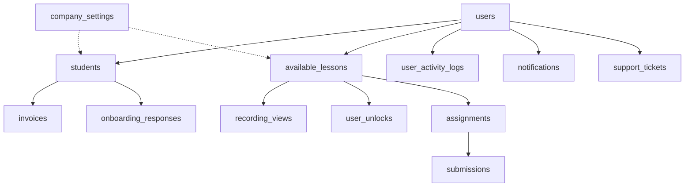

# Database Documentation

Complete reference for the Growth OS database architecture, including tables, relationships, security policies, functions, and storage.

**Developed by Core47.ai** | Enterprise-grade PostgreSQL Architecture

## 📊 Database Overview

Growth OS uses **PostgreSQL** (via Supabase) with:
- **38 Production Tables** organized into 10 functional areas
- **35+ Database Functions** (security, notifications, automation)
- **200+ Row-Level Security (RLS) Policies** for access control
- **25+ Database Triggers** for automation
- **4 Storage Buckets** for file management
- **5 User Roles** (Superadmin, Admin, Enrollment Manager, Mentor, Student)

[View Complete Overview →](./overview.md)

## 📁 Documentation Files

### Core References

| Document | Description | Use Case |
|----------|-------------|----------|
| [**Overview**](./overview.md) | High-level architecture, statistics, functional areas | Understand system structure |
| [**Tables Reference**](./tables-reference.md) | Complete table schemas, columns, constraints | Schema reference |
| [**Security**](./security.md) | RLS policies, access control matrix | Security implementation |
| [**Functions**](./functions.md) | All database functions with signatures | Function reference |
| [**Storage Buckets**](./storage-buckets.md) | File storage configuration and policies | File management |
| [**Table Relationships**](./table-relationships.md) | Entity relationships, foreign keys, data flow | Understand dependencies |

### Migration Resources

| Resource | Description |
|----------|-------------|
| [**migrations/**](./migrations/) | Individual migration SQL files by feature area |
| [Database Setup Guide](../deployment/database-setup.md) | Chronological database setup instructions |

## 🎯 Quick Navigation

### By Task

**Creating New Tables:**
1. Review [Table Relationships](./table-relationships.md) to understand connections
2. Design schema following patterns in [Tables Reference](./tables-reference.md)
3. Add RLS policies using [Security](./security.md) as template
4. Create migration file in [migrations](./migrations/)
5. Update [Database Setup](../deployment/database-setup.md)

**Understanding Access Control:**
1. Start with [Security Overview](./security.md)
2. Review `get_current_user_role()` function in [Functions](./functions.md)
3. See policy examples for your table type
4. Test with different user roles

**Adding Functions:**
1. Review existing functions in [Functions](./functions.md)
2. Follow SECURITY DEFINER pattern for RLS bypassing
3. Document function purpose and parameters
4. Add to appropriate migration file

**Setting Up Storage:**
1. Review [Storage Buckets](./storage-buckets.md)
2. Create bucket with correct publicity setting
3. Add storage RLS policies
4. Test upload/download flows

### By User Role

**Superadmin:**
- Full access to all tables and functions
- Can view all data across the system
- Manages company settings and branding

**Admin:**
- Access to users, students, assignments, submissions
- Can manage financial data and invoices
- View activity logs and notifications

**Enrollment Manager:**
- Create and manage students
- View and update student information
- Limited financial access

**Mentor:**
- View assigned students only
- Review and grade assignments
- Manage mentorship sessions

**Student:**
- View own data only
- Submit assignments
- Access learning materials based on unlock status

## 🗄️ Functional Areas

### 1. User Management (6 tables)
Core user and authentication functionality.

**Tables:** `users`, `students`, `onboarding_responses`, `user_activity_logs`, `admin_logs`, `student_recovery_messages`

**Key Functions:** `create_user_with_role()`, `validate_user_role()`, `get_current_user_role()`

[View Details →](./overview.md#user-management)

### 2. Learning & Content (10 tables)
Course delivery, modules, recordings, and progress tracking.

**Tables:** `modules`, `available_lessons`, `recording_attachments`, `recording_views`, `recording_ratings`, `user_unlocks`, `assignments`, `submissions`, `badges`, `user_badges`

**Key Functions:** `initialize_first_recording_unlock()`, `unlock_next_recording()`, `is_recording_watched()`, `handle_sequential_submission_approval()`

[View Details →](./overview.md#learning-content-delivery)

### 3. Financial System (4 tables)
Payments, installments, and invoice management.

**Tables:** `invoices`, `installment_payments`, `installment_plans`, `company_settings` (financial fields)

**Key Functions:** `audit_invoice_changes()`, Stripe integration edge functions

[View Details →](./overview.md#financial-system)

### 4. Communication (5 tables)
Notifications, messages, and communication channels.

**Tables:** `notifications`, `notification_templates`, `notification_settings`, `messages`, `email_queue`

**Key Functions:** `notify_users()`, `notify_roles()`, `create_notification()`, `interpolate_template()`

[View Details →](./overview.md#communication-notifications)

### 5. Support & Sessions (4 tables)
Help desk and live mentorship sessions.

**Tables:** `support_tickets`, `support_ticket_replies`, `success_sessions`, `segmented_weekly_success_sessions`

**Key Functions:** `notify_on_ticket_update()`, `handle_success_session_changes()`

[View Details →](./overview.md#support-mentorship)

### 6. Integrations (3 tables)
External service connections and metrics.

**Tables:** `integrations`, `user_metrics`, `success_partner_credits`

[View Details →](./overview.md#integrations-external-services)

### 7. System Configuration (2 tables)
Company settings and course tracks.

**Tables:** `company_settings`, `course_tracks`

[View Details →](./overview.md#system-configuration)

### 8. Gamification (2 tables)
Milestones and achievement tracking.

**Tables:** `milestones`, `milestone_categories`

[View Details →](./overview.md#gamification-achievements)

### 9. Storage (4 buckets)
File storage for assignments, branding, and recordings.

**Buckets:** `assignment-files`, `assignment-submissions`, `company-branding`, `recording-attachments`

[View Details →](./storage-buckets.md)

### 10. Security Functions
Critical security and validation functions.

**Functions:** `get_current_user_role()`, `has_role()`, `validate_user_role()`, `log_data_access_attempt()`

[View Details →](./functions.md#security-functions)

## 🔐 Critical Security Information

### ⚠️ Pre-Launch Security Warning

**STATUS**: 🔴 **NOT READY FOR PUBLIC LAUNCH** - Critical security issues present

**Summary of Issues**:
1. ❌ Password hash exposure via RLS policy (enrollment managers can view passwords)
2. ❌ Missing RLS policies on `user_security_summary` table
3. ❌ Hardcoded Supabase credentials in source code
4. ⚠️ 3 Supabase linter warnings need resolution

**Action Required**: See [Security Issues Document](../../docs/SECURITY_ISSUES.md) for complete details and remediation steps.

### The `get_current_user_role()` Function

**⚠️ CRITICAL**: This function is the foundation of the entire security system. It's referenced in 68 RLS policies across all tables.

```sql
-- This function MUST be created FIRST before any RLS policies
CREATE OR REPLACE FUNCTION get_current_user_role()
RETURNS TEXT
LANGUAGE sql
SECURITY DEFINER
SET search_path = public
AS $$
  SELECT role FROM public.users WHERE id = auth.uid()
$$;
```

**Why it's critical:**
- Used by 200+ RLS policies
- Enables role-based access control
- Prevents recursive RLS issues
- MUST be created before any policies

[Learn More →](./security.md#critical-security-function)

### RLS Policy Patterns

All tables follow consistent RLS patterns:

1. **Read Access**: Based on user role
2. **Write Access**: Role-based with ownership checks
3. **Admin Override**: Superadmin/Admin full access
4. **Student Isolation**: Students see only their data

[View Policy Examples →](./security.md#rls-policy-patterns)

## 📈 Database Statistics

### Size & Scale
- **38 Production Tables** (excluding auth/storage schemas)
- **5 User Roles** with granular permissions
- **10 Functional Areas** for organization

### Security
- **200+ RLS Policies** providing row-level security
- **35+ Functions** (15 security, 10 notification, 10 progress tracking)
- **25+ Triggers** for automation

### Relationships
- **50+ Foreign Key Constraints** ensuring data integrity
- **Complex Dependencies** between learning, user, and financial systems
- **Cascade Deletes** properly configured for user deletion

## 🔗 Table Relationships

### High-Impact Tables
These tables are referenced by many others:

1. **users** - Referenced by 15+ tables
2. **students** - Core of learning system (10+ references)
3. **available_lessons** - Learning content hub
4. **assignments** - Assignment workflow
5. **company_settings** - System-wide configuration

### Relationship Diagram



[View Complete Relationships →](./table-relationships.md)

## 🛠️ Common Tasks

### Adding a New Table

```sql
-- 1. Create the table
CREATE TABLE public.your_table (
  id UUID PRIMARY KEY DEFAULT gen_random_uuid(),
  user_id UUID REFERENCES public.users(id) ON DELETE CASCADE,
  created_at TIMESTAMPTZ DEFAULT now(),
  -- ... other columns
);

-- 2. Enable RLS
ALTER TABLE public.your_table ENABLE ROW LEVEL SECURITY;

-- 3. Add policies
CREATE POLICY "Users can view own records"
ON public.your_table FOR SELECT
USING (auth.uid() = user_id);

-- 4. Create indexes
CREATE INDEX idx_your_table_user_id ON public.your_table(user_id);
```

### Creating a Security Definer Function

```sql
CREATE OR REPLACE FUNCTION public.your_function(param TYPE)
RETURNS TYPE
LANGUAGE plpgsql
SECURITY DEFINER  -- Bypasses RLS
SET search_path = public
AS $$
BEGIN
  -- Function logic
  RETURN result;
END;
$$;
```

### Adding a Storage Bucket

```sql
-- Create bucket
INSERT INTO storage.buckets (id, name, public)
VALUES ('your-bucket', 'your-bucket', false);

-- Add RLS policy
CREATE POLICY "Users upload own files"
ON storage.objects FOR INSERT
WITH CHECK (
  bucket_id = 'your-bucket' AND
  auth.uid()::text = (storage.foldername(name))[1]
);
```

## 📚 Additional Resources

### External Documentation
- [Supabase Database](https://supabase.com/docs/guides/database)
- [PostgreSQL Documentation](https://www.postgresql.org/docs/)
- [Row Level Security Guide](https://supabase.com/docs/guides/auth/row-level-security)

### Internal Documentation
- [Deployment Guide](../deployment/README.md) - Database setup instructions
- [Feature Documentation](../features/README.md) - Feature-specific database usage
- [Database Creation Guide](../../docs/database-creation-guide.md) - Original comprehensive guide

## ⚠️ Important Notes

### Do NOT Modify
- **auth schema** - Managed by Supabase
- **storage schema** - Managed by Supabase  
- **realtime schema** - Managed by Supabase
- **vault schema** - Managed by Supabase

### Always Remember
- Create `get_current_user_role()` function FIRST
- Enable RLS on all user-facing tables
- Use SECURITY DEFINER for functions that need to bypass RLS
- Test policies with different user roles
- Never expose password fields via RLS policies
- Review Supabase linter warnings before production
- Document all custom functions
- Add migrations to version control
- Rotate credentials after security incidents

---

**Need Help?**
- Check [Troubleshooting](../deployment/verification-checklist.md)
- Review [Security Policies](./security.md)
- Consult [Function Reference](./functions.md)
- Contact Core47.ai Support: support@core47.ai

**Developed by Core47.ai** - © 2025 Core47.ai. All rights reserved.
