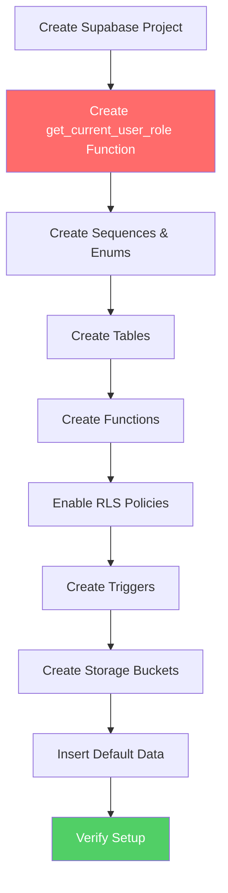
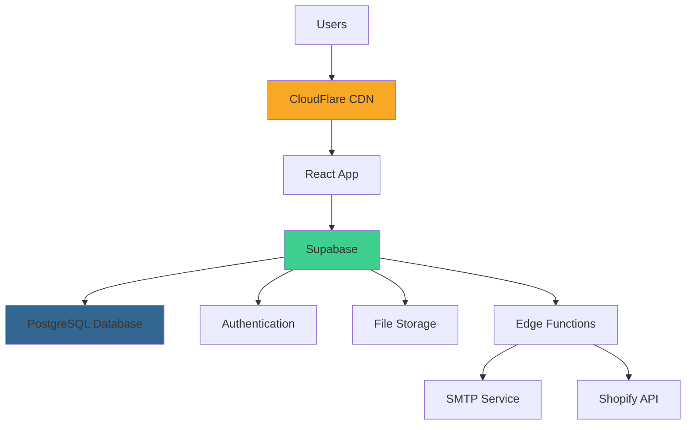

# Deployment Documentation

Complete deployment guides for Growth OS across different platforms and environments.

**Developed by Core47.ai** | Professional Deployment Support Available

## 🚀 Quick Start

### For First-Time Deployment

1. **Choose Your Platform**: [CloudFlare Workers](#platform-guides) | Vercel | Netlify
2. **Set Up Database**: Follow [Database Setup](./database-setup.md) step-by-step
3. **Configure SMTP**: Choose from [SMTP Setup Guides](./smtp-secrets/)
4. **Set Environment Variables**: Use [Environment Variables](./environment-variables.md)
5. **Verify Deployment**: Run [Verification Checklist](./verification-checklist.md)

### Deployment Time Estimate
- **Database Setup**: 30-45 minutes (first time)
- **Platform Deployment**: 15-30 minutes
- **SMTP Configuration**: 10-15 minutes
- **Testing & Verification**: 15-20 minutes
- **Total**: ~1.5-2 hours

## 📋 Deployment Guides

### Platform Guides

| Platform | Best For | Deployment Time | Documentation |
|----------|----------|-----------------|---------------|
| **CloudFlare Workers** | Fast global deployment | ~20 min | [Guide](./cloudflare-workers.md) ⭐ |
| **Vercel** | Automatic deployments from Git | ~15 min | Coming soon |
| **Netlify** | Simple static + functions | ~15 min | Coming soon |
| **Self-Hosted** | Full control | ~30 min | Coming soon |

⭐ **Recommended for most users**

### Database Setup

| Guide | Description | Prerequisites |
|-------|-------------|---------------|
| [**Database Setup**](./database-setup.md) | Complete chronological setup | Supabase account |
| [Supabase Setup](./supabase-setup.md) | Create Supabase project | Email account |

### Configuration

| Guide | Purpose |
|-------|---------|
| [**Environment Variables**](./environment-variables.md) | All ENV configuration |
| [**SMTP Secrets**](./smtp-secrets/README.md) | Email setup (Resend, Gmail, Custom) |
| [Edge Functions](./edge-functions.md) | Deploy serverless functions |

### Verification

| Resource | Use Case |
|----------|----------|
| [**Verification Checklist**](./verification-checklist.md) | Post-deployment testing |

## 🎯 Deployment Workflow

### Phase 1: Platform Preparation

**CloudFlare Workers (Recommended):**
```bash
# 1. Install Wrangler CLI
npm install -g wrangler

# 2. Login to CloudFlare
wrangler login

# 3. CRITICAL: Delete bun.lockb file
rm bun.lockb

# 4. Configure wrangler.toml
# See CloudFlare Workers guide
```

[View Complete CloudFlare Guide →](./cloudflare-workers.md)

### Phase 2: Database Setup

**Critical: Follow in exact order!**



[View Complete Database Setup →](./database-setup.md)

**⚠️ CRITICAL**: The `get_current_user_role()` function MUST be created first. Without it, RLS policies will fail.

### Phase 3: SMTP Configuration

Choose one email provider:

**Option 1: Resend (Recommended)**
- Modern API
- Generous free tier
- Easy setup

[Resend Setup Guide →](./smtp-secrets/resend-setup.md)

**Option 2: Gmail SMTP**
- Use existing Gmail account
- Requires App Password
- Good for testing

[Gmail Setup Guide →](./smtp-secrets/smtp-gmail-setup.md)

**Option 3: Custom SMTP**
- Any SMTP provider
- SendGrid, Mailgun, SES, etc.

[Custom SMTP Guide →](./smtp-secrets/smtp-custom-setup.md)

### Phase 4: Environment Configuration

Set all required environment variables:

```bash
# Supabase
VITE_SUPABASE_URL=https://your-project.supabase.co
VITE_SUPABASE_ANON_KEY=your_anon_key

# SMTP (via Supabase Secrets)
# Set these in Supabase Dashboard → Edge Functions → Secrets
SMTP_HOST=smtp.resend.com
SMTP_PORT=587
SMTP_USER=resend
SMTP_PASSWORD=re_xxxxx
SMTP_FROM_EMAIL=noreply@yourdomain.com
SMTP_FROM_NAME=Your Company
```

[View All Variables →](./environment-variables.md)

### Phase 5: Edge Functions Deployment

Deploy all Edge Functions:

```bash
# Deploy all functions
supabase functions deploy --project-ref YOUR_PROJECT_REF

# Or deploy individually
supabase functions deploy create-student --project-ref YOUR_PROJECT_REF
```

[View Edge Functions Guide →](./edge-functions.md)

### Phase 6: Verification

Run through the verification checklist:

- ✅ Database tables created
- ✅ RLS policies active
- ✅ Edge Functions deployed
- ✅ SMTP configured
- ✅ Storage buckets accessible
- ✅ User authentication working
- ✅ Email notifications sending

[Complete Verification Checklist →](./verification-checklist.md)

## 🔐 Security Checklist

Before going to production:

### Database Security
- [ ] All tables have RLS enabled
- [ ] `get_current_user_role()` function exists
- [ ] Test policies with different user roles
- [ ] Verify students can't access other students' data
- [ ] Check admin access is working

### Application Security
- [ ] Environment variables set as secrets
- [ ] SMTP credentials in Supabase Secrets (not code)
- [ ] SSL/TLS enabled on custom domain
- [ ] CORS properly configured
- [ ] Rate limiting enabled

### Data Protection
- [ ] Backups configured
- [ ] Audit logging active
- [ ] Password policies enforced
- [ ] Session timeout configured

## 🌍 Environment Setup

### Development

```bash
# Local development with Supabase
git clone <repository>
cd growth-os
npm install
cp .env.example .env
# Configure .env with your Supabase project
npm run dev
```

### Staging

```bash
# Deploy to staging environment
# 1. Create staging Supabase project
# 2. Run database migrations on staging
# 3. Deploy frontend to staging platform
# 4. Test all features thoroughly
```

### Production

```bash
# Production deployment
# 1. Create production Supabase project
# 2. Run database migrations
# 3. Configure custom domain
# 4. Set production environment variables
# 5. Deploy to CloudFlare Workers/Vercel
# 6. Run verification checklist
```

## 📊 Deployment Architecture



## 🛠️ Platform-Specific Notes

### CloudFlare Workers
- **CRITICAL**: Delete `bun.lockb` file before deployment
- Fast global edge network
- Automatic HTTPS
- Generous free tier
- [Complete Guide →](./cloudflare-workers.md)

### Vercel
- Automatic Git deployments
- Preview deployments for PRs
- Easy environment variable management
- Excellent DX

### Netlify
- Simple deployment from Git
- Built-in forms and functions
- Excellent for JAMstack

## 📈 Post-Deployment

### Monitoring

Set up monitoring for:
- Application uptime
- Database performance
- Email delivery rates
- Error tracking
- User analytics

### Backup Strategy

Configure backups for:
- Database (daily automated)
- Storage buckets (weekly)
- Configuration settings

### Maintenance

Regular tasks:
- Update dependencies monthly
- Review error logs weekly
- Check security advisories
- Optimize slow queries
- Clean up old data

## 🆘 Troubleshooting

### Common Issues

**Database Connection Failed**
- Check Supabase project status
- Verify connection string
- Check firewall rules

**Emails Not Sending**
- Verify SMTP secrets in Supabase
- Check domain verification
- Review Edge Function logs

**Storage Upload Failed**
- Check bucket policies
- Verify bucket exists
- Check file size limits

**Authentication Not Working**
- Verify Supabase configuration
- Check RLS policies
- Test `get_current_user_role()` function

[View Verification Checklist →](./verification-checklist.md)

## 📚 Additional Resources

### Official Documentation
- [Supabase Docs](https://supabase.com/docs)
- [CloudFlare Workers Docs](https://developers.cloudflare.com/workers/)
- [Vite Deployment](https://vitejs.dev/guide/static-deploy.html)

### Internal Documentation
- [Database Documentation](../database/README.md)
- [Feature Documentation](../features/README.md)
- [Main README](../../README.md)

## 🎯 Quick Links

### Essential Guides
1. [CloudFlare Workers Deployment](./cloudflare-workers.md) ⭐
2. [Database Setup](./database-setup.md) ⭐
3. [SMTP Configuration](./smtp-secrets/README.md) ⭐
4. [Verification Checklist](./verification-checklist.md) ⭐

### Configuration
- [Environment Variables](./environment-variables.md)
- [Supabase Setup](./supabase-setup.md)
- [Edge Functions](./edge-functions.md)

---

**Ready to deploy?** Start with the [CloudFlare Workers Guide](./cloudflare-workers.md) or [Database Setup](./database-setup.md)!

**Developed by Core47.ai** - © 2025 Core47.ai. All rights reserved.  
**Enterprise Support**: enterprise@core47.ai  
**Website**: https://core47.ai
