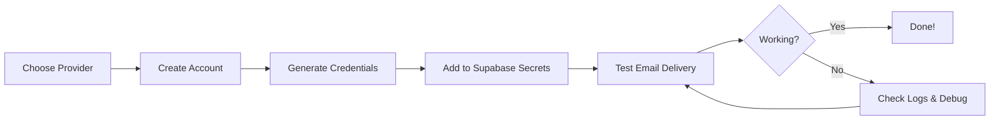

# SMTP Configuration Guides

Email delivery is essential for Growth OS to send notifications, invoices, password resets, and communications. This guide covers setting up SMTP with different providers.

## 📧 Why SMTP is Required

Growth OS sends emails for:
- **User Management**: Welcome emails, password resets, account activation
- **Notifications**: Assignment updates, session reminders, system alerts
- **Financial**: Invoice delivery, payment confirmations, reminders
- **Support**: Ticket updates, resolution notifications
- **Mentorship**: Session schedules, feedback notifications

**Without SMTP**: Users won't receive important notifications and the system cannot communicate via email.

## 🎯 Choose Your Email Provider

| Provider | Best For | Free Tier | Difficulty | Guide |
|----------|----------|-----------|------------|-------|
| **Resend** | Production | 100 emails/day | ⭐ Easy | [Guide](./resend-setup.md) |
| **Gmail SMTP** | Testing/Small scale | Limited | ⭐⭐ Medium | [Guide](./smtp-gmail-setup.md) |
| **SendGrid** | High volume | 100 emails/day | ⭐⭐ Medium | [Guide](./smtp-custom-setup.md) |
| **Amazon SES** | Large scale | 62,000 emails/month | ⭐⭐⭐ Hard | [Guide](./smtp-custom-setup.md) |
| **Mailgun** | Developers | 5,000 emails/month | ⭐⭐ Medium | [Guide](./smtp-custom-setup.md) |
| **Custom SMTP** | Any provider | Varies | ⭐⭐ Medium | [Guide](./smtp-custom-setup.md) |

### ⭐ Recommended: Resend

**Why Resend?**
- Modern API-first design
- Generous free tier (100 emails/day)
- Simple setup (5 minutes)
- Excellent deliverability
- Built for transactional emails

[**→ Resend Setup Guide**](./resend-setup.md)

## 🔧 SMTP Configuration Process

### Overview



### Required Secrets

All SMTP providers require these credentials in Supabase:

```bash
SMTP_HOST=smtp.your-provider.com
SMTP_PORT=587  # or 465 for SSL
SMTP_USER=your_username
SMTP_PASSWORD=your_password
SMTP_FROM_EMAIL=noreply@yourdomain.com
SMTP_FROM_NAME=Your Company Name
```

## 📝 Setup Steps (All Providers)

### Step 1: Choose Provider

Review the comparison table above and select the best provider for your needs.

- **Just testing?** → Use [Gmail](./smtp-gmail-setup.md)
- **Production ready?** → Use [Resend](./resend-setup.md)
- **High volume?** → Use [Custom SMTP](./smtp-custom-setup.md) (SendGrid, SES, Mailgun)

### Step 2: Create Account & Get Credentials

Follow the provider-specific guide:
- [Resend Setup](./resend-setup.md) - Recommended ⭐
- [Gmail SMTP Setup](./smtp-gmail-setup.md) - Testing
- [Custom SMTP Setup](./smtp-custom-setup.md) - Other providers

### Step 3: Add Secrets to Supabase

**CRITICAL**: Never put SMTP credentials in your code or environment variables. Always use Supabase Secrets.

#### Via Supabase Dashboard

1. **Open Supabase Dashboard**
   - Navigate to https://supabase.com/dashboard
   - Select your project

2. **Go to Edge Functions Secrets**
   - Click "Settings" in sidebar
   - Click "Edge Functions"
   - Scroll to "Secrets" section

3. **Add Each Secret**
   - Click "Add Secret"
   - Enter secret name (e.g., `SMTP_HOST`)
   - Enter secret value
   - Click "Save"

4. **Repeat for all SMTP secrets**:
   ```
   SMTP_HOST
   SMTP_PORT
   SMTP_USER
   SMTP_PASSWORD
   SMTP_FROM_EMAIL
   SMTP_FROM_NAME
   ```

#### Via Supabase CLI

```bash
# Set secrets via CLI
supabase secrets set SMTP_HOST=smtp.resend.com --project-ref YOUR_PROJECT_REF
supabase secrets set SMTP_PORT=587 --project-ref YOUR_PROJECT_REF
supabase secrets set SMTP_USER=resend --project-ref YOUR_PROJECT_REF
supabase secrets set SMTP_PASSWORD=re_xxxxx --project-ref YOUR_PROJECT_REF
supabase secrets set SMTP_FROM_EMAIL=noreply@yourdomain.com --project-ref YOUR_PROJECT_REF
supabase secrets set SMTP_FROM_NAME="Your Company" --project-ref YOUR_PROJECT_REF
```

### Step 4: Verify Secrets

```bash
# List all secrets (values hidden)
supabase secrets list --project-ref YOUR_PROJECT_REF
```

**Expected Output:**
```
NAME                 CREATED AT
SMTP_HOST            2024-01-01T00:00:00Z
SMTP_PORT            2024-01-01T00:00:00Z
SMTP_USER            2024-01-01T00:00:00Z
SMTP_PASSWORD        2024-01-01T00:00:00Z
SMTP_FROM_EMAIL      2024-01-01T00:00:00Z
SMTP_FROM_NAME       2024-01-01T00:00:00Z
```

### Step 5: Test Email Delivery

Use the Edge Function to test:

```bash
# Test email delivery
supabase functions invoke process-email-queue --project-ref YOUR_PROJECT_REF
```

Or test from the application:
1. Login as admin
2. Create a test notification
3. Check email delivery logs

## 🔍 Verification Checklist

After setup, verify:

- [ ] All 6 SMTP secrets added to Supabase
- [ ] Secrets visible in Supabase Dashboard
- [ ] Test email sent successfully
- [ ] Email received in inbox (check spam)
- [ ] Email formatting correct
- [ ] Links in email working
- [ ] Sender name/email correct

## 🚨 Troubleshooting

### Emails Not Sending

**Check Edge Function Logs:**
```bash
supabase functions logs process-email-queue --project-ref YOUR_PROJECT_REF
```

**Common Errors:**

#### "Authentication Failed"
```
Error: 535 Authentication failed
```

**Solution:**
- Verify SMTP_USER and SMTP_PASSWORD correct
- For Gmail: Ensure App Password (not regular password)
- For Resend: Check API key is valid

#### "Connection Refused"
```
Error: ECONNREFUSED
```

**Solution:**
- Check SMTP_HOST is correct
- Verify SMTP_PORT (587 for TLS, 465 for SSL)
- Check firewall not blocking port

#### "Sender Not Verified"
```
Error: 550 Sender not verified
```

**Solution:**
- Verify domain in email provider
- For Resend: Add and verify domain
- Use verified sender email

#### "Rate Limited"
```
Error: 421 Rate limit exceeded
```

**Solution:**
- Check you haven't exceeded free tier
- Upgrade plan if needed
- Implement email queuing

### Emails Going to Spam

**Improve Deliverability:**

1. **Verify Domain**: Add SPF, DKIM, DMARC records
2. **Use Real From Address**: Not generic noreply
3. **Warm Up IP**: Start with low volume
4. **Good Content**: Avoid spam trigger words
5. **Unsubscribe Link**: Always include
6. **Authentication**: Use proper SMTP auth

### Debug Commands

```bash
# Check secrets exist
supabase secrets list --project-ref YOUR_PROJECT_REF

# View Edge Function logs
supabase functions logs process-email-queue --project-ref YOUR_PROJECT_REF

# Test email function
supabase functions invoke process-email-queue --project-ref YOUR_PROJECT_REF

# Check email queue in database
# Run in Supabase SQL Editor:
SELECT * FROM email_queue ORDER BY created_at DESC LIMIT 10;
```

## 📊 Email Monitoring

### Check Email Queue Status

```sql
-- View pending emails
SELECT 
  id,
  email_type,
  recipient_email,
  status,
  retry_count,
  error_message,
  created_at
FROM email_queue
WHERE status = 'pending'
ORDER BY created_at DESC;
```

### Check Sent Emails

```sql
-- View recently sent emails
SELECT 
  email_type,
  recipient_email,
  status,
  sent_at,
  error_message
FROM email_queue
WHERE status = 'sent'
ORDER BY sent_at DESC
LIMIT 50;
```

### Check Failed Emails

```sql
-- View failed emails
SELECT 
  email_type,
  recipient_email,
  status,
  retry_count,
  error_message,
  created_at
FROM email_queue
WHERE status = 'failed'
ORDER BY created_at DESC;
```

## 🔐 Security Best Practices

### Do's ✅

- ✅ Use Supabase Secrets for all SMTP credentials
- ✅ Enable 2FA on email provider account
- ✅ Use App Passwords (for Gmail)
- ✅ Rotate credentials every 90 days
- ✅ Monitor email delivery logs
- ✅ Set up SPF/DKIM/DMARC records

### Don'ts ❌

- ❌ Never commit SMTP credentials to Git
- ❌ Don't use environment variables for secrets
- ❌ Don't share API keys in documentation
- ❌ Don't use personal email for production
- ❌ Don't skip domain verification
- ❌ Don't ignore bounced emails

## 📚 Provider-Specific Guides

### Quick Links

- [**Resend Setup**](./resend-setup.md) - Recommended for production ⭐
- [**Gmail SMTP Setup**](./smtp-gmail-setup.md) - Good for testing
- [**Custom SMTP Setup**](./smtp-custom-setup.md) - SendGrid, SES, Mailgun, etc.

### Comparison

| Feature | Resend | Gmail | SendGrid | Amazon SES | Mailgun |
|---------|--------|-------|----------|------------|---------|
| Free Tier | 100/day | Limited | 100/day | 62k/month | 5k/month |
| Setup Time | 5 min | 10 min | 15 min | 30 min | 15 min |
| API Quality | Excellent | Basic | Good | Complex | Good |
| Deliverability | Excellent | Good | Excellent | Excellent | Good |
| Support | Good | Limited | Good | Good | Good |

## 🎯 Next Steps

1. **Choose Provider**: Review options and select best fit
2. **Follow Setup Guide**: Complete provider-specific configuration
3. **Add to Supabase**: Configure secrets in Supabase Dashboard
4. **Test Delivery**: Send test emails and verify receipt
5. **Monitor**: Set up logging and monitoring
6. **Go Live**: Enable email notifications in production

---

**Ready to set up SMTP?**
- [**Resend Setup →**](./resend-setup.md) (Recommended)
- [**Gmail Setup →**](./smtp-gmail-setup.md) (Testing)
- [**Custom SMTP →**](./smtp-custom-setup.md) (Advanced)
