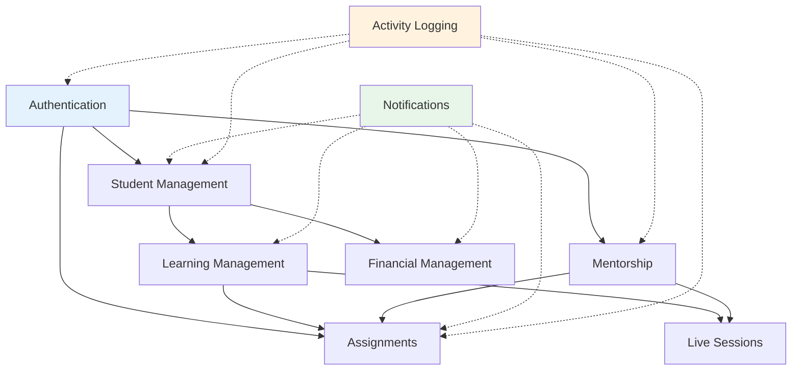

# Features Documentation

Complete documentation for all Growth OS features, organized by implementation status.

**Developed by Core47.ai** | Enterprise Learning Management System

## 📊 Feature Status Matrix

### ✅ Complete Features (12)

| Feature | Purpose | Key Components | Users |
|---------|---------|----------------|-------|
| [Authentication System](./authentication-system.md) | User login & role management | 5 roles, RLS policies | All |
| [Student Management](./student-management.md) | Student lifecycle & onboarding | Enrollment, questionnaires | Admin, Student |
| [Learning Management](./learning-management.md) | Course delivery & progression | Modules, videos, sequential unlock | Student, Admin |
| [Assignment System](./assignment-system.md) | Assignments & submissions | Submission types, mentor review | Student, Mentor |
| [Financial Management](./financial-management.md) | Payments & invoices | Installments, invoice generation | Admin, Student |
| [Notifications System](./notifications-system.md) | In-app & email notifications | Templates, preferences | All |
| [Support Tickets](./support-tickets.md) | Help desk system | Ticket management, replies | All |
| [Live Sessions](./live-sessions.md) | Mentorship sessions | Scheduling, Zoom integration | Mentor, Student |
| [Mentorship Program](./mentorship-program.md) | Mentor-student relationships | Assignment review, guidance | Mentor, Student |
| [Company Branding](./company-branding.md) | Custom branding | Logos, colors, email branding | Superadmin |
| [Activity Logging](./user-activity-logging.md) | Audit trails & analytics | User actions, admin logs | Admin |
| [Reporting & Analytics](./reporting-analytics.md) | Performance dashboards | Student metrics, financials | Admin, Mentor |

### 🚧 Partial Implementation (1)

| Feature | Status | What's Working | What's Missing |
|---------|--------|----------------|----------------|
| [Messaging System](./messaging-system.md) | 40% Complete | Basic message submission, display, search | Real-time chat, direct messaging, file attachments |

### ⚠️ Pre-Launch Security Warnings

**CRITICAL**: Several security vulnerabilities have been identified that MUST be resolved before public launch:

1. **Password Hash Exposure** - Enrollment managers can view password hashes
2. **Missing RLS Policies** - `user_security_summary` table lacks access control
3. **Hardcoded Credentials** - Supabase credentials in source code
4. **Console Logging** - 253 statements exposing sensitive data

**Action Required**: Review [Security Issues Document](../../docs/SECURITY_ISSUES.md) and [Pre-Launch Checklist](../../docs/PRE_LAUNCH_CHECKLIST.md) before deployment.

**Launch Readiness**: 🔴 **NOT READY** - Estimated 2-3 weeks to resolve critical issues

### 📋 Planned for v2.0 (2)

| Feature | Planned Release | Key Features |
|---------|----------------|--------------|
| [Leaderboard System](./leaderboard-system.md) | Q2 2025 | Gamification, rankings, badges, competitions |
| [Certificate System](./certificates-system.md) | Q2 2025 | Automated certificates, digital signatures, verification |

## 🎯 Feature Categories

### Core Learning Features
- **[Learning Management System](./learning-management.md)** - Content delivery and progress tracking
- **[Assignment System](./assignment-system.md)** - Practical exercises and assessments
- **[Mentorship Program](./mentorship-program.md)** - One-on-one guidance and support
- **[Live Sessions](./live-sessions.md)** - Real-time mentorship sessions

### Student Lifecycle
- **[Student Management](./student-management.md)** - Enrollment, onboarding, lifecycle
- **[Financial Management](./financial-management.md)** - Payments, installments, invoices
- **[Certificate System](./certificates-system.md)** _(Planned)_ - Achievement recognition

### Engagement & Motivation
- **[Notifications System](./notifications-system.md)** - Keep users informed and engaged
- **[Leaderboard System](./leaderboard-system.md)** _(Planned)_ - Gamification and competition
- **[Messaging System](./messaging-system.md)** _(Partial)_ - Direct communication

### Administrative & Support
- **[Authentication System](./authentication-system.md)** - Security and access control
- **[Support Tickets](./support-tickets.md)** - Help desk and issue resolution
- **[Activity Logging](./user-activity-logging.md)** - Audit trails and compliance
- **[Reporting & Analytics](./reporting-analytics.md)** - Performance insights

### Customization
- **[Company Branding](./company-branding.md)** - Custom logos, colors, and branding

## 📖 Documentation Structure

Each feature documentation includes:

### 1. Overview
- Feature purpose and value proposition
- Use cases and scenarios
- System diagrams

### 2. User-Facing Behavior
- How different roles interact with the feature
- Workflows and processes
- UI/UX patterns

### 3. Technical Implementation
- Core components and files
- Database tables used
- Edge Functions involved
- Hooks and utilities

### 4. Configuration
- Environment variables
- Database settings
- Feature flags
- Hard-coded defaults

### 5. Security
- Access control policies
- Data protection measures
- Privacy considerations
- Audit requirements

### 6. Integration Points
- How the feature connects with others
- API endpoints
- Event triggers
- Data dependencies

### 7. Troubleshooting
- Common issues and solutions
- Debug queries
- Performance optimization

## 🔗 Cross-Feature Dependencies

### High-Impact Features
These features are used by many others:

1. **Authentication System** - Required by ALL features
2. **Notifications System** - Used by 10+ features
3. **Activity Logging** - Tracks actions across all features
4. **Student Management** - Foundation for learning features

### Feature Dependencies Map

## 🚀 Quick Navigation

### By User Role

**Superadmin:**
- [Authentication System](./authentication-system.md) - User management
- [Company Branding](./company-branding.md) - Customization
- [Activity Logging](./user-activity-logging.md) - System audit
- [Reporting & Analytics](./reporting-analytics.md) - System metrics

**Admin:**
- [Student Management](./student-management.md) - Enrollment
- [Financial Management](./financial-management.md) - Payments
- [Support Tickets](./support-tickets.md) - Customer service
- [Reporting & Analytics](./reporting-analytics.md) - Analytics

**Enrollment Manager:**
- [Student Management](./student-management.md) - Student creation
- [Financial Management](./financial-management.md) - Invoice tracking
- [Support Tickets](./support-tickets.md) - Support

**Mentor:**
- [Mentorship Program](./mentorship-program.md) - Student guidance
- [Assignment System](./assignment-system.md) - Create and review assignments
- [Live Sessions](./live-sessions.md) - Host sessions
- [Reporting & Analytics](./reporting-analytics.md) - Student progress
- **Note**: Mentors can edit content but not create/delete structure (see [Mentor Permission Changes](../../docs/MENTOR_PERMISSION_CHANGES.md))

**Student:**
- [Learning Management](./learning-management.md) - Access content
- [Assignment System](./assignment-system.md) - Submit work
- [Live Sessions](./live-sessions.md) - Attend sessions
- [Messaging System](./messaging-system.md) - Communication

### By Development Priority

**Must Understand First:**
1. [Authentication System](./authentication-system.md)
2. [Student Management](./student-management.md)
3. [Learning Management](./learning-management.md)

**Core Features:**
4. [Assignment System](./assignment-system.md)
5. [Notifications System](./notifications-system.md)
6. [Mentorship Program](./mentorship-program.md)

**Supporting Features:**
7. [Financial Management](./financial-management.md)
8. [Live Sessions](./live-sessions.md)
9. [Support Tickets](./support-tickets.md)
10. [Company Branding](./company-branding.md)

**Advanced Features:**
11. [Activity Logging](./user-activity-logging.md)
12. [Reporting & Analytics](./reporting-analytics.md)

## 💡 Usage Guidelines

### For Developers
- Start with authentication to understand access control
- Review database schema in [Database Documentation](../database/)
- Check integration points before modifying features
- Update documentation when adding features

### For System Administrators
- Understand user roles and permissions
- Configure feature flags appropriately
- Monitor activity logs regularly
- Review security policies

### For Product Managers
- Check feature status before planning
- Understand dependencies between features
- Review user workflows for each role
- Consider cross-feature impacts

## 📝 Adding New Features

When adding new features:

1. **Create Documentation File**: Use existing features as templates
2. **Update Status Matrix**: Add to appropriate section above
3. **Document Dependencies**: Note which features it integrates with
4. **Add Database Changes**: Document in [Database](../database/) section
5. **Update Cross-References**: Link from related features
6. **Add to Navigation**: Update this README

## 🔍 Search by Keyword

- **Payments**: [Financial Management](./financial-management.md)
- **Video Lessons**: [Learning Management](./learning-management.md)
- **Homework**: [Assignment System](./assignment-system.md)
- **Email**: [Notifications System](./notifications-system.md)
- **1-on-1 Meetings**: [Live Sessions](./live-sessions.md) or [Mentorship Program](./mentorship-program.md)
- **Help Desk**: [Support Tickets](./support-tickets.md)
- **Branding**: [Company Branding](./company-branding.md)
- **Access Control**: [Authentication System](./authentication-system.md)
- **Audit Trail**: [Activity Logging](./user-activity-logging.md)
- **Dashboards**: [Reporting & Analytics](./reporting-analytics.md)

---

**For deployment instructions**, see [Deployment Documentation](../deployment/README.md)

**For database details**, see [Database Documentation](../database/README.md)

**Developed by Core47.ai** - © 2025 Core47.ai. All rights reserved.
