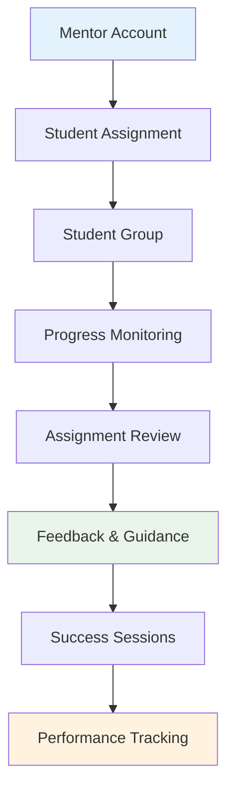
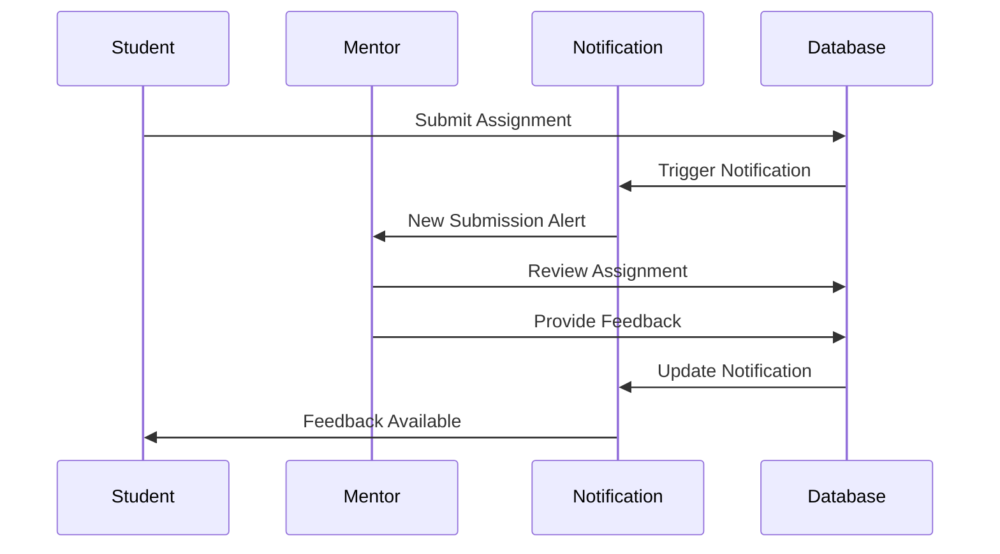

# Mentorship Program

## Overview

The mentorship program creates one-on-one relationships between mentors and students, providing personalized guidance, assignment review, progress tracking, and career development support throughout the learning journey.

## Mentorship Structure



## Core Features

### 1. Mentor Management

**Mentor Account Creation:**
- Admin-initiated mentor account setup
- Role assignment with specific permissions
- Profile configuration with expertise areas
- Availability and capacity settings

**Code Entry Points:**
- `src/components/admin/MentorManagement.tsx` - Mentor CRUD operations
- `src/pages/MentorDashboard.tsx` - Mentor main interface
- `src/components/mentor/` - Mentor-specific components

**Mentor Profile Structure:**
```sql
-- Mentor information stored in users table
SELECT 
  id,
  full_name,
  email,
  role, -- 'mentor'
  status, -- 'Active', 'Inactive'
  created_at,
  -- Additional mentor-specific data can be stored in separate table
FROM users WHERE role = 'mentor';
```

### 2. Student-Mentor Assignment

**Assignment Methods:**

**Manual Assignment (Current Implementation):**
- Admin assigns students to specific mentors
- One-to-many relationship (mentor can have multiple students)
- Assignment tracked via `mentor_id` field in student record

```typescript
// Assign student to mentor
const assignStudentToMentor = async (studentId: string, mentorId: string) => {
  const { error } = await supabase
    .from('users')
    .update({ mentor_id: mentorId })
    .eq('id', studentId);
  
  if (!error) {
    // Send notification to mentor
    await notifyMentorOfNewStudent(mentorId, studentId);
  }
};
```

**Automatic Assignment (Future Enhancement):**
- Load balancing based on mentor capacity
- Skill matching between mentor expertise and student needs
- Geographic or timezone-based assignment
- Learning style compatibility

### 3. Student Progress Monitoring

**Progress Dashboard for Mentors:**

**Key Metrics Displayed:**
- Student completion rates
- Assignment submission status
- Time spent learning
- Quiz performance
- Engagement levels
- Recent activity

**Implementation:**
```typescript
// Mentor dashboard data fetching
const useMentorStudentProgress = (mentorId: string) => {
  return useQuery({
    queryKey: ['mentor-students', mentorId],
    queryFn: async () => {
      const { data: students } = await supabase
        .from('users')
        .select(`
          id,
          full_name,
          email,
          status,
          user_module_progress(*),
          submissions(*)
        `)
        .eq('mentor_id', mentorId)
        .eq('role', 'student');
      
      return students;
    }
  });
};
```

**Progress Visualization:**
- Individual student progress charts
- Comparative progress across all assigned students
- Timeline view of student activities
- Milestone achievement tracking

### 4. Assignment Review System

**Mentor Assignment Workflow:**

**Review Interface Features:**
- Pending submissions queue
- Student work preview
- Feedback text editor
- Approval/rejection controls
- Bulk review operations

**Code Entry Points:**
- `src/components/assignments/SubmissionsManagement.tsx` - Review interface
- `src/components/mentor/StudentProgress.tsx` - Student overview

**Review Process:**


### 5. Mentorship Notes & Communication

**Mentorship Notes System:**
- Private notes about student progress
- Session summaries and action items
- Personal development observations
- Learning style adaptations

**Database Schema:**
```sql
CREATE TABLE mentorship_notes (
  id UUID PRIMARY KEY DEFAULT gen_random_uuid(),
  mentor_id UUID REFERENCES users(id),
  student_id UUID REFERENCES users(id),
  note TEXT,
  added_at TIMESTAMPTZ DEFAULT now()
);
```

**Note Management:**
```typescript
const addMentorshipNote = async (
  mentorId: string, 
  studentId: string, 
  note: string
) => {
  const { error } = await supabase
    .from('mentorship_notes')
    .insert({
      mentor_id: mentorId,
      student_id: studentId,
      note: note
    });
  
  return !error;
};
```

### 6. Success Sessions

**One-on-One Sessions:**
- Scheduled mentorship meetings
- Video call integration (future)
- Session preparation templates
- Follow-up action items

**Session Management:**
- Calendar integration
- Automated reminders
- Session notes and recordings
- Attendance tracking

**Code Entry Points:**
- `src/components/mentor/MentorSessions.tsx` - Session management
- `src/pages/LiveSessions.tsx` - Session scheduling interface

## Mentor Experience

### Mentor Dashboard

**Dashboard Components:**
1. **Student Overview**: List of assigned students with quick stats
2. **Pending Reviews**: Assignment submissions awaiting feedback
3. **Recent Activity**: Student learning activity summary
4. **Upcoming Sessions**: Scheduled mentorship meetings
5. **Performance Metrics**: Teaching effectiveness analytics

**Dashboard Implementation:**
```typescript
const MentorDashboard = () => {
  const { user } = useAuth();
  const [students, setStudents] = useState([]);
  const [pendingSubmissions, setPendingSubmissions] = useState([]);
  
  useEffect(() => {
    if (user?.role === 'mentor') {
      fetchMentorStudents(user.id);
      fetchPendingSubmissions(user.id);
    }
  }, [user]);
  
  return (
    <div className="mentor-dashboard">
      <StudentOverview students={students} />
      <PendingReviews submissions={pendingSubmissions} />
      <PerformanceMetrics mentorId={user.id} />
    </div>
  );
};
```

### Student Management Tools

**Individual Student View:**
- Complete learning history
- Assignment submission timeline
- Communication log
- Personal notes section
- Progress milestones

**Batch Operations:**
- Send announcements to all students
- Schedule group sessions
- Export progress reports
- Bulk feedback on similar assignments

### Communication Tools

**Direct Messaging:**
- In-app messaging system
- Email integration
- Video call scheduling
- File sharing capabilities

**Group Communication:**
- Announcements to all assigned students
- Group discussion forums
- Study group coordination
- Peer learning facilitation

## Student Experience

### Mentor Connection

**Mentor Information Display:**
- Mentor profile and expertise
- Contact information and availability
- Response time expectations
- Communication preferences

**Student-Mentor Interaction:**
- Direct messaging capabilities
- Session booking system
- Progress review meetings
- Feedback request system

### Guidance Integration

**Learning Path Guidance:**
- Personalized recommendations
- Difficulty adjustment suggestions
- Career guidance integration
- Industry insights sharing

**Progress Feedback:**
- Regular check-ins
- Milestone celebrations
- Challenge identification
- Support resource recommendations

## Configuration Matrix

### Environment Variables

No specific environment variables required for core mentorship functionality.

### Dashboard Settings

**Mentor Management Configuration:**
- **Student Capacity**: Default maximum students per mentor (configurable)
- **Assignment Review SLA**: Expected response time for assignment feedback
- **Session Duration**: Default length for mentorship sessions
- **Communication Preferences**: Preferred contact methods per mentor

### Hard-coded Defaults

**Mentorship Rules:**
```typescript
const MENTORSHIP_CONFIG = {
  MAX_STUDENTS_PER_MENTOR: 20, // Configurable limit
  ASSIGNMENT_REVIEW_SLA_HOURS: 48, // Expected feedback timeframe
  SESSION_DURATION_MINUTES: 60, // Default session length
  NOTE_RETENTION_DAYS: 365, // How long to keep mentorship notes
  AUTO_ASSIGNMENT: false // Manual assignment by default
};
```

**Notification Settings:**
```typescript
const MENTOR_NOTIFICATIONS = {
  NEW_STUDENT_ASSIGNMENT: true,
  PENDING_SUBMISSION_REMINDER: true,
  STUDENT_MILESTONE_ACHIEVED: true,
  SESSION_REMINDERS: true,
  OVERDUE_FEEDBACK_ALERT: true
};
```

## Advanced Features

### 1. Mentor Matching Algorithm

**Matching Criteria:**
- Subject matter expertise
- Teaching style compatibility
- Student learning preferences
- Geographic/timezone alignment
- Mentor availability and capacity

**Implementation Framework:**
```typescript
interface MentorMatchingCriteria {
  subjectExpertise: string[];
  teachingStyle: 'visual' | 'auditory' | 'kinesthetic' | 'mixed';
  availableHours: number;
  timezone: string;
  maxStudents: number;
  currentStudentCount: number;
}

const findBestMentorMatch = (
  student: StudentProfile, 
  availableMentors: MentorProfile[]
): MentorProfile => {
  // Implement matching algorithm
  return calculateBestMatch(student, availableMentors);
};
```

### 2. Mentor Performance Analytics

**Performance Metrics:**
- Student completion rates
- Assignment review timeliness
- Feedback quality scores
- Student satisfaction ratings
- Career progression of mentored students

**Analytics Dashboard:**
```sql
-- Mentor effectiveness metrics
CREATE VIEW mentor_performance AS
SELECT 
  m.id as mentor_id,
  m.full_name as mentor_name,
  COUNT(DISTINCT s.id) as total_students,
  AVG(
    CASE WHEN ump.is_completed THEN 100.0 ELSE 0.0 END
  ) as avg_completion_rate,
  AVG(
    EXTRACT(EPOCH FROM (sub.updated_at - sub.created_at))/3600
  ) as avg_review_time_hours
FROM users m
LEFT JOIN users s ON m.id = s.mentor_id
LEFT JOIN user_module_progress ump ON s.id = ump.user_id
LEFT JOIN submissions sub ON s.id = sub.student_id
WHERE m.role = 'mentor'
GROUP BY m.id, m.full_name;
```

### 3. Peer Mentorship

**Peer Learning Features:**
- Advanced students mentoring beginners
- Study groups facilitated by mentors
- Peer review systems
- Collaborative project assignments

**Implementation Considerations:**
- Peer mentor certification process
- Supervised peer interactions
- Quality control mechanisms
- Recognition and rewards system

## Notification Integration

### Mentor Notifications

**Real-time Alerts:**
- New student assignments
- Pending submission reminders
- Student milestone achievements
- Overdue feedback alerts
- Upcoming session reminders

**Notification Delivery:**
```typescript
const notifyMentorOfNewSubmission = async (
  mentorId: string,
  studentName: string,
  assignmentTitle: string
) => {
  await supabase.functions.invoke('create-notification', {
    body: {
      user_id: mentorId,
      type: 'assignment_submission',
      title: 'New Assignment Submission',
      message: `${studentName} has submitted "${assignmentTitle}"`,
      metadata: {
        student_name: studentName,
        assignment_title: assignmentTitle
      }
    }
  });
};
```

### Student Notifications

**Mentorship-Related Alerts:**
- Mentor assignment confirmation
- Feedback received from mentor
- Session scheduling updates
- Mentor availability changes
- Mentorship milestone achievements

## Security Considerations

### Data Privacy

**Student Information Access:**
- Mentors can only view assigned students' data
- Personal information protection
- Communication privacy
- Note confidentiality

**Access Control Implementation:**
```sql
-- Mentors can only view assigned students
CREATE POLICY "mentors_view_assigned_students" ON users
FOR SELECT USING (
  mentor_id = auth.uid() 
  OR (role = 'mentor' AND auth.uid() = id)
);

-- Mentors can only access their own notes
CREATE POLICY "mentors_own_notes" ON mentorship_notes
FOR ALL USING (auth.uid() = mentor_id);
```

### Communication Security

**Safe Communication Practices:**
- All communications logged and auditable
- Inappropriate content detection
- Professional boundary maintenance
- Escalation procedures for issues

### Mentor Verification

**Mentor Qualification Checks:**
- Background verification process
- Professional credential validation
- Reference checks and interviews
- Ongoing performance monitoring

## Analytics & Reporting

### Mentorship Effectiveness

**Program-Wide Metrics:**
- Student completion rates by mentor
- Average time to course completion
- Student satisfaction scores
- Career outcome tracking
- Retention rates

**Individual Mentor Analytics:**
```sql
-- Individual mentor performance report
SELECT 
  m.full_name as mentor_name,
  COUNT(s.id) as active_students,
  AVG(student_metrics.completion_rate) as avg_completion_rate,
  AVG(student_metrics.satisfaction_score) as avg_satisfaction,
  COUNT(CASE WHEN s.status = 'Passed out / Completed' THEN 1 END) as graduated_students
FROM users m
LEFT JOIN users s ON m.id = s.mentor_id AND s.role = 'student'
LEFT JOIN (
  -- Subquery for student metrics
  SELECT 
    user_id,
    COUNT(CASE WHEN is_completed THEN 1 END) * 100.0 / COUNT(*) as completion_rate,
    -- Add satisfaction score logic here
    NULL as satisfaction_score
  FROM user_module_progress
  GROUP BY user_id
) student_metrics ON s.id = student_metrics.user_id
WHERE m.role = 'mentor'
GROUP BY m.id, m.full_name;
```

### Student Success Correlation

**Success Factor Analysis:**
- Mentor engagement frequency vs. student outcomes
- Communication style effectiveness
- Feedback quality impact on performance
- Session frequency correlation with completion

## Failure Modes

### Mentor Unavailability

**Coverage Strategies:**
- Backup mentor assignment
- Temporary mentor substitution
- Automated escalation procedures
- Emergency contact protocols

**Implementation:**
```typescript
const handleMentorUnavailability = async (mentorId: string, reason: string) => {
  // Find backup mentor or reassign students
  const affectedStudents = await getStudentsByMentor(mentorId);
  const backupMentors = await findAvailableMentors();
  
  // Implement reassignment logic
  await reassignStudents(affectedStudents, backupMentors);
  
  // Notify affected parties
  await notifyStudentsOfMentorChange(affectedStudents, reason);
};
```

### Communication Breakdowns

**Issue Resolution:**
- Automated escalation triggers
- Alternative communication channels
- Conflict resolution procedures
- Emergency contact systems

### Quality Control

**Performance Issues:**
- Mentor performance monitoring
- Student feedback collection
- Quality assurance reviews
- Improvement plan implementation

## Extension Guidelines

### Adding Mentor Specializations

**Specialization Framework:**
```sql
-- Add mentor specialization tracking
CREATE TABLE mentor_specializations (
  id UUID PRIMARY KEY DEFAULT gen_random_uuid(),
  mentor_id UUID REFERENCES users(id),
  specialization TEXT NOT NULL,
  proficiency_level INTEGER CHECK (proficiency_level BETWEEN 1 AND 5),
  certification_url TEXT,
  verified BOOLEAN DEFAULT false
);
```

**UI Integration:**
- Specialization selection during mentor creation
- Student-mentor matching based on specializations
- Specialization display in mentor profiles
- Performance tracking by specialization

### Video Conferencing Integration

**Platform Integration Options:**
- Zoom API integration
- Google Meet embedding
- Microsoft Teams integration
- Custom WebRTC solution

**Session Management:**
```typescript
const scheduleVideoSession = async (
  mentorId: string,
  studentId: string,
  scheduledTime: Date,
  platform: 'zoom' | 'meet' | 'teams'
) => {
  // Create meeting in chosen platform
  const meetingDetails = await createMeeting(platform, scheduledTime);
  
  // Store session details
  await supabase.from('mentorship_sessions').insert({
    mentor_id: mentorId,
    student_id: studentId,
    scheduled_time: scheduledTime,
    meeting_url: meetingDetails.joinUrl,
    platform: platform
  });
  
  // Send calendar invites
  await sendCalendarInvites(mentorId, studentId, meetingDetails);
};
```

### AI-Powered Mentorship Assistance

**AI Enhancement Features:**
- Automated progress analysis
- Personalized recommendation generation
- Early warning system for at-risk students
- Mentor coaching suggestions

**Implementation Considerations:**
- Privacy and data protection
- Human oversight requirements
- Accuracy validation
- Bias detection and mitigation

## Troubleshooting

### Common Issues

**1. Mentor-Student Assignment Problems**
```sql
-- Check assignment relationships
SELECT 
  m.full_name as mentor_name,
  COUNT(s.id) as assigned_students
FROM users m
LEFT JOIN users s ON m.id = s.mentor_id
WHERE m.role = 'mentor'
GROUP BY m.id, m.full_name;
```

**2. Communication Delivery Issues**
```sql
-- Check notification delivery to mentors
SELECT * FROM notifications 
WHERE user_id IN (SELECT id FROM users WHERE role = 'mentor')
ORDER BY sent_at DESC LIMIT 50;
```

**3. Performance Query Optimization**
```sql
-- Add indexes for mentor queries
CREATE INDEX idx_users_mentor_id ON users(mentor_id);
CREATE INDEX idx_mentorship_notes_mentor_student ON mentorship_notes(mentor_id, student_id);
CREATE INDEX idx_submissions_mentor_lookup ON submissions(student_id);
```

### Debug Commands

```bash
# Check mentor dashboard performance
time curl -X GET "https://majqoqagohicjigmsilu.supabase.co/rest/v1/users?role=eq.student&mentor_id=eq.uuid" \
  -H "Authorization: Bearer <token>"

# Test notification delivery
curl -X POST "https://majqoqagohicjigmsilu.supabase.co/functions/v1/create-notification" \
  -H "Content-Type: application/json" \
  -H "Authorization: Bearer <token>" \
  -d '{"user_id":"mentor-uuid","type":"test","title":"Test","message":"Test notification"}'
```

## Next Steps

The mentorship program integrates with [Financial Management](./financial-management.md) features to provide mentors with visibility into student payment status and engagement correlation.