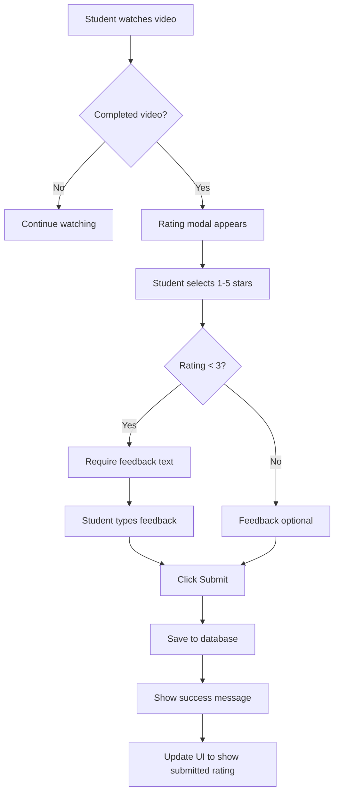
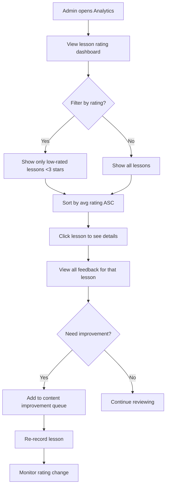

# Recording Ratings System

**Status**: ✅ Complete | **Developed by**: [Core47.ai](https://core47.ai)

---

## Overview

The Recording Ratings System allows students to provide feedback on video content through a 5-star rating system with optional text feedback. This helps admins identify which lessons are effective and which need improvement.

---

## Purpose & Value

### Problem Solved
- **No Feedback Loop**: Admins don't know which lessons are confusing or ineffective
- **Content Quality**: No data to prioritize content improvements
- **Student Engagement**: No way for students to express satisfaction/frustration
- **Resource Allocation**: Can't identify which lessons need re-recording

### Business Value
- **Data-Driven Improvements**: Know exactly which lessons to improve first
- **Quality Control**: Identify poorly performing content before it affects completion rates
- **Student Voice**: Show students their feedback matters
- **ROI Tracking**: Measure impact of content updates (rating before vs. after)

### User Impact
- **Students**: Feel heard, influence course quality
- **Admins**: Clear data on what to improve
- **Mentors**: Identify where students struggle in specific lessons

---

## How It Works

### For Students

1. **Watch Video**: Student watches lesson video
2. **Rating Prompt**: After video, rating modal appears (or accessible anytime)
3. **Select Stars**: Choose 1-5 stars
4. **Optional Feedback**: Add text explaining rating
5. **Submit**: Rating saved and displayed to admins
6. **Update Anytime**: Students can update their rating later

**Rating Scale**:
- ⭐ (1 star): Very poor, confusing, needs major improvement
- ⭐⭐ (2 stars): Below average, some issues
- ⭐⭐⭐ (3 stars): Average, acceptable
- ⭐⭐⭐⭐ (4 stars): Good, helpful content
- ⭐⭐⭐⭐⭐ (5 stars): Excellent, very clear and valuable

### For Admins

**Features**:
- **Rating Analytics**: View average rating per lesson
- **Feedback Dashboard**: Read all text feedback
- **Low-Rated Lessons**: Identify lessons with <3 stars
- **Trending**: See which lessons improved after updates
- **Export**: Download feedback for analysis

**Dashboard Metrics**:
- Average rating per lesson
- Number of ratings per lesson
- Distribution (how many 1-star, 2-star, etc.)
- Recent feedback (last 7 days)

---

## Technical Implementation

### Database Tables

| Table | Purpose | Key Columns |
|-------|---------|-------------|
| `recording_ratings` | Store ratings and feedback | `user_id`, `lesson_id`, `rating`, `feedback`, `created_at` |

### Table Schema

```sql
CREATE TABLE recording_ratings (
  id UUID PRIMARY KEY DEFAULT gen_random_uuid(),
  user_id UUID NOT NULL REFERENCES users(id) ON DELETE CASCADE,
  lesson_id UUID NOT NULL REFERENCES available_lessons(id) ON DELETE CASCADE,
  rating INTEGER NOT NULL CHECK (rating >= 1 AND rating <= 5),
  feedback TEXT,
  created_at TIMESTAMPTZ DEFAULT now(),
  updated_at TIMESTAMPTZ DEFAULT now(),
  UNIQUE(user_id, lesson_id) -- One rating per student per lesson
);
```

**Key Constraints**:
- `rating` must be between 1-5
- `UNIQUE(user_id, lesson_id)`: Student can only rate each lesson once (but can update)
- `ON DELETE CASCADE`: If user or lesson deleted, rating is deleted

---

### Functions

#### `get_lesson_average_rating(p_lesson_id UUID)`

**Purpose**: Calculate average rating for a lesson.

**Returns**: `NUMERIC(3,2)` (e.g., 4.23)

**Example**:
```sql
SELECT get_lesson_average_rating('lesson-uuid');
-- Returns: 4.23
```

---

#### `get_lesson_rating_distribution(p_lesson_id UUID)`

**Purpose**: Get count of each star rating for a lesson.

**Returns**: `TABLE(rating INTEGER, count INTEGER)`

**Example**:
```sql
SELECT * FROM get_lesson_rating_distribution('lesson-uuid');
-- Returns:
-- rating | count
-- -------+-------
--   1    |   2
--   2    |   5
--   3    |  10
--   4    |  20
--   5    |  15
```

---

### Edge Functions

**None** - Ratings are simple database operations (INSERT/UPDATE), no edge function needed.

---

### Frontend Components

#### `LectureRating.tsx`

**Location**: `src/components/LectureRating.tsx`

**Features**:
- Star rating input (1-5 stars)
- Optional text feedback field
- Submit button
- "Update rating" if already rated
- Display current rating if user already rated

**Props**:
```typescript
interface LectureRatingProps {
  lessonId: string;
  userId: string;
  onRatingSubmit?: () => void;
}
```

**Usage**:
```tsx
import LectureRating from '@/components/LectureRating';

// In video player component
<LectureRating 
  lessonId={lesson.id} 
  userId={currentUser.id}
  onRatingSubmit={() => toast.success("Thanks for your feedback!")}
/>
```

---

#### `RecordingRatingDetails.tsx`

**Location**: `src/components/superadmin/RecordingRatingDetails.tsx`

**Features**:
- View all ratings for a specific lesson
- Filter by star rating
- Sort by date
- Export to CSV

**Usage**:
```tsx
import RecordingRatingDetails from '@/components/superadmin/RecordingRatingDetails';

<RecordingRatingDetails lessonId={lesson.id} />
```

---

### Hooks

#### `useRecordingRatings(lessonId: string)`

**Location**: `src/hooks/useRecordingRatings.ts`

**Purpose**: Fetch and manage ratings for a lesson.

**Returns**:
```typescript
{
  ratings: Rating[];
  averageRating: number;
  totalRatings: number;
  distribution: { 1: number, 2: number, 3: number, 4: number, 5: number };
  isLoading: boolean;
  error: Error | null;
}
```

**Example**:
```tsx
const { averageRating, totalRatings, distribution } = useRecordingRatings(lessonId);

<p>Average: {averageRating.toFixed(1)} ⭐ ({totalRatings} ratings)</p>
```

---

#### `useVideoRating(lessonId: string, userId: string)`

**Location**: `src/hooks/useVideoRating.ts`

**Purpose**: Get and submit rating for specific user and lesson.

**Returns**:
```typescript
{
  currentRating: number | null;
  currentFeedback: string | null;
  submitRating: (rating: number, feedback?: string) => Promise<void>;
  isSubmitting: boolean;
  error: Error | null;
}
```

**Example**:
```tsx
const { currentRating, submitRating, isSubmitting } = useVideoRating(lessonId, userId);

const handleSubmit = async (stars: number, text: string) => {
  await submitRating(stars, text);
};
```

---

## Configuration

### Environment Variables

```env
# Enable/disable rating system
VITE_ENABLE_RECORDING_RATINGS=true

# Require feedback for low ratings
VITE_REQUIRE_FEEDBACK_LOW_RATINGS=true

# Min rating to not require feedback
VITE_MIN_RATING_NO_FEEDBACK=4
```

### Database Settings

**No additional configuration needed** - System works out-of-the-box once table is created.

**Optional**: Set minimum ratings threshold via `company_settings`:
```sql
UPDATE company_settings 
SET settings = jsonb_set(
  COALESCE(settings, '{}'::jsonb), 
  '{min_ratings_for_analytics}', 
  '5'::jsonb
);
-- Only show analytics for lessons with 5+ ratings
```

---

## Workflows

### Student Rating Flow



### Admin Analysis Flow



---

## Access Control

### RLS Policies

**`recording_ratings` table**:

1. **`recording_ratings_insert_own`** - Students can rate lessons
   ```sql
   CREATE POLICY "recording_ratings_insert_own" 
   ON recording_ratings
   FOR INSERT WITH CHECK (auth.uid() = user_id);
   ```

2. **`recording_ratings_update_own`** - Students can update their own ratings
   ```sql
   CREATE POLICY "recording_ratings_update_own" 
   ON recording_ratings
   FOR UPDATE USING (auth.uid() = user_id);
   ```

3. **`recording_ratings_select_own`** - Students see their own ratings
   ```sql
   CREATE POLICY "recording_ratings_select_own" 
   ON recording_ratings
   FOR SELECT USING (auth.uid() = user_id);
   ```

4. **`recording_ratings_select_admin`** - Admins see all ratings
   ```sql
   CREATE POLICY "recording_ratings_select_admin" 
   ON recording_ratings
   FOR SELECT USING (
     get_current_user_role() IN ('admin', 'superadmin')
   );
   ```

### Role Permissions

| Role | Can Rate | View Own Ratings | View All Ratings | Delete Ratings |
|------|----------|------------------|------------------|----------------|
| Student | ✅ | ✅ | ❌ | ❌ |
| Mentor | ✅ | ✅ | Assigned students | ❌ |
| Enrollment Manager | ❌ | ❌ | ❌ | ❌ |
| Admin | ✅ | ✅ | ✅ | ✅ |
| Superadmin | ✅ | ✅ | ✅ | ✅ |

---

## Integration Points

### Integrates With

- **Video Player**: Rating prompt appears after video completion
- **Student Dashboard**: Shows ratings given
- **Analytics Dashboard**: Displays rating trends
- **Content Management**: Flags low-rated lessons for review
- **Notifications**: Alerts admins when lesson gets <2 stars

### Triggers

**Rating Submitted**:
- Update `available_lessons` aggregate rating
- Notify admin if rating < 2 stars
- Log to `admin_logs` if feedback mentions "broken" or "error"

### Events Emitted

- `rating_submitted`: When student rates a lesson
- `rating_updated`: When student changes their rating
- `low_rating_alert`: When rating < 2 stars (notifies admin)

---

## Troubleshooting

### Common Issues

#### **Issue**: Student can't submit rating

**Possible Causes**:
1. Already rated (unique constraint)
2. Lesson ID invalid
3. RLS policy blocking insert

**Solution**:
```sql
-- Check if already rated
SELECT * FROM recording_ratings 
WHERE user_id = 'user-uuid' AND lesson_id = 'lesson-uuid';

-- If exists, student should UPDATE not INSERT
-- Frontend should check first and show "Update Rating" button

-- Check RLS policies
SELECT * FROM pg_policies 
WHERE tablename = 'recording_ratings';
```

---

#### **Issue**: Average rating not updating

**Possible Causes**:
1. Cached data on frontend
2. Function not being called
3. No trigger to update aggregate

**Solution**:
```sql
-- Manually recalculate average
SELECT AVG(rating)::NUMERIC(3,2) 
FROM recording_ratings 
WHERE lesson_id = 'lesson-uuid';

-- Clear Supabase cache (if using Supabase Realtime)
-- Refresh frontend component
```

---

#### **Issue**: Feedback text not saving

**Possible Causes**:
1. Column length limit (shouldn't be an issue with TEXT type)
2. SQL injection attempt (special characters)
3. RLS policy blocking update

**Solution**:
```sql
-- Check feedback is being saved
SELECT feedback FROM recording_ratings 
WHERE id = 'rating-uuid';

-- Check for any weird characters
SELECT feedback, LENGTH(feedback), octet_length(feedback) 
FROM recording_ratings 
WHERE id = 'rating-uuid';
```

---

### Debug Queries

#### View lowest-rated lessons
```sql
SELECT 
  al.title,
  COUNT(rr.id) AS num_ratings,
  AVG(rr.rating)::NUMERIC(3,2) AS avg_rating,
  COUNT(*) FILTER (WHERE rr.rating <= 2) AS low_ratings
FROM available_lessons al
LEFT JOIN recording_ratings rr ON rr.lesson_id = al.id
GROUP BY al.id, al.title
HAVING COUNT(rr.id) >= 5  -- Only lessons with 5+ ratings
ORDER BY avg_rating ASC
LIMIT 10;
```

#### View recent feedback
```sql
SELECT 
  u.full_name,
  al.title AS lesson,
  rr.rating,
  rr.feedback,
  rr.created_at
FROM recording_ratings rr
JOIN users u ON u.id = rr.user_id
JOIN available_lessons al ON al.id = rr.lesson_id
WHERE rr.feedback IS NOT NULL
ORDER BY rr.created_at DESC
LIMIT 20;
```

#### Rating distribution for lesson
```sql
SELECT 
  rr.rating,
  COUNT(*) AS count,
  ROUND(COUNT(*) * 100.0 / SUM(COUNT(*)) OVER (), 1) AS percentage
FROM recording_ratings rr
WHERE rr.lesson_id = 'lesson-uuid'
GROUP BY rr.rating
ORDER BY rr.rating DESC;
```

---

## API Reference

**No REST API** - Frontend uses Supabase client directly:

**Submit Rating**:
```typescript
const { error } = await supabase
  .from('recording_ratings')
  .upsert({
    user_id: userId,
    lesson_id: lessonId,
    rating: 5,
    feedback: 'Great lesson!',
    updated_at: new Date().toISOString()
  });
```

**Get Lesson Ratings**:
```typescript
const { data: ratings } = await supabase
  .from('recording_ratings')
  .select('*')
  .eq('lesson_id', lessonId);
```

**Calculate Average**:
```typescript
const { data } = await supabase
  .from('recording_ratings')
  .select('rating')
  .eq('lesson_id', lessonId);

const avgRating = data.reduce((sum, r) => sum + r.rating, 0) / data.length;
```

---

## Future Enhancements

### Planned Features (v2.1)

- **Thumbs Up/Down**: Quick feedback in addition to stars
- **Feedback Categories**: Tag feedback ("audio quality", "too fast", "confusing")
- **Mentor Response**: Allow mentors to respond to feedback
- **A/B Testing**: Track rating changes after content updates
- **Anonymous Ratings**: Option for students to rate anonymously
- **Rating Reminders**: Notify students to rate after X days if they haven't

---

## Support

For issues with recording ratings:

1. Check [Troubleshooting](#troubleshooting) section above
2. Verify RLS policies are correct
3. Check frontend console for errors
4. Contact: [support@core47.ai](mailto:support@core47.ai)

---

**Developed by Core47.ai** - © 2025 Core47.ai. All rights reserved.  
**Website**: [core47.ai](https://core47.ai) | **Support**: [support@core47.ai](mailto:support@core47.ai)
