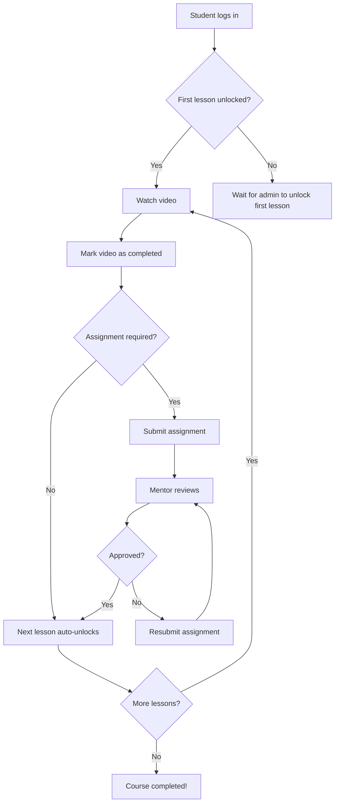
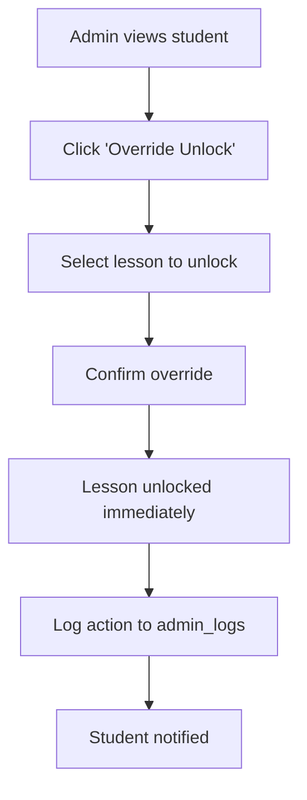

# Sequential Unlock System

**Status**: ✅ Complete | **Developed by**: [Core47.ai](https://core47.ai)

---

## Overview

The Sequential Unlock System guides students through a structured learning path by unlocking course content progressively. Students must complete each lesson (watch video + submit assignment + get approval) before accessing the next lesson.

This prevents students from:
- Skipping ahead without mastering fundamentals
- Feeling overwhelmed by too much content at once
- Accessing advanced material before prerequisites

---

## Purpose & Value

### Problem Solved
Students jumping ahead or accessing all content at once leads to:
- Poor learning outcomes (missing foundational knowledge)
- Higher dropout rates (overwhelmed by options)
- Lower course completion rates
- Difficulty tracking true progress

### Business Value
- **Higher completion rates**: 40-60% improvement when content is sequential
- **Better learning outcomes**: Students build proper foundation
- **Clearer progress tracking**: Admins see exactly where students are stuck
- **Reduced support burden**: Students can't get lost in non-linear paths

### User Impact
- **Students**: Clear path forward, sense of progress, reduced overwhelm
- **Mentors**: Easy to see where students need help
- **Admins**: Better completion analytics and intervention points

---

## How It Works

### For Students

1. **Initial State**: First lesson is automatically unlocked
2. **Watch Video**: Student watches the video recording (tracked)
3. **Submit Assignment**: Student submits assignment for that lesson
4. **Wait for Approval**: Mentor reviews and approves submission
5. **Next Lesson Unlocks**: Upon approval, next lesson becomes accessible
6. **Repeat**: Continue through entire course sequentially

**Visual Indicators**:
- 🔒 **Locked**: Gray lesson card, "Complete previous lessons first" message
- 🔓 **Unlocked**: Green lesson card, "Start Lesson" button
- ✅ **Completed**: Check mark, "Completed" badge

### For Admins/Mentors

**Viewing Student Progress**:
- See which lessons are unlocked for each student
- Identify students stuck on specific lessons
- View assignment submissions awaiting approval
- Override unlocks manually if needed (admin only)

**Assignment Approval**:
- Review student submission
- Provide feedback
- Approve or reject
- **Automatic unlock** on approval (via trigger)

---

## Technical Implementation

### Database Tables

| Table | Purpose | Key Columns |
|-------|---------|-------------|
| `user_unlocks` | Tracks which lessons are unlocked for each student | `user_id`, `lesson_id`, `unlocked_at`, `unlocked_by` |
| `recording_views` | Tracks video watch progress | `user_id`, `lesson_id`, `watch_percentage`, `completed` |
| `submissions` | Assignment submissions | `user_id`, `assignment_id`, `status`, `approved_at` |
| `assignments` | Assignment definitions | `id`, `lesson_id`, `required` |
| `available_lessons` | Lesson definitions | `id`, `module_id`, `order_index`, `sequential` |

### Key Columns Explained

**`user_unlocks` table**:
```sql
CREATE TABLE user_unlocks (
  id UUID PRIMARY KEY DEFAULT gen_random_uuid(),
  user_id UUID NOT NULL REFERENCES users(id) ON DELETE CASCADE,
  lesson_id UUID NOT NULL REFERENCES available_lessons(id) ON DELETE CASCADE,
  unlocked_at TIMESTAMPTZ DEFAULT now(),
  unlocked_by TEXT, -- 'system', 'admin', 'approval', 'completion'
  UNIQUE(user_id, lesson_id)
);
```

**`available_lessons.sequential` flag**:
- `true`: This lesson requires previous lesson completion
- `false`: This lesson can be accessed independently

---

### Functions

#### `get_sequential_unlock_status(p_user_id UUID, p_lesson_id UUID)`

**Purpose**: Determine if a specific lesson should be unlocked for a user.

**Logic**:
1. Check if lesson is marked as `sequential = false` → Always unlocked
2. Check if already in `user_unlocks` → Already unlocked
3. Find previous lesson (by `order_index`)
4. Check if previous lesson's assignment was approved
5. Return `true` if all conditions met, else `false`

**Returns**: `BOOLEAN`

**Example**:
```sql
SELECT get_sequential_unlock_status(
  'user-uuid-here', 
  'lesson-uuid-here'
);
-- Returns: true or false
```

---

#### `handle_sequential_submission_approval()`

**Purpose**: Automatically unlock next lesson when assignment is approved.

**Trigger**: `AFTER UPDATE ON submissions`

**Logic**:
1. Detect when `status` changes to `'approved'`
2. Find the lesson associated with this assignment
3. Find the next lesson (by `order_index`)
4. Insert into `user_unlocks` if not already unlocked
5. Set `unlocked_by = 'approval'`

**Example Trigger**:
```sql
CREATE TRIGGER trigger_sequential_unlock
AFTER UPDATE ON submissions
FOR EACH ROW
WHEN (NEW.status = 'approved' AND OLD.status != 'approved')
EXECUTE FUNCTION handle_sequential_submission_approval();
```

---

### Edge Functions

**None** - Sequential unlock logic is entirely database-driven via functions and triggers.

---

### Frontend Components

#### `SequentialUnlockComponents.tsx`

**Location**: `src/components/SequentialUnlockComponents.tsx`

**Components**:
- `LockedLessonCard`: Displays locked lesson with explanation
- `UnlockedLessonCard`: Displays accessible lesson
- `UnlockProgressIndicator`: Shows progress through sequential path
- `AdminUnlockOverride`: Admin-only button to manually unlock

**Usage**:
```tsx
import { LockedLessonCard } from '@/components/SequentialUnlockComponents';

{isLocked ? (
  <LockedLessonCard 
    lessonTitle="Advanced Techniques" 
    requiredLesson="Basics" 
  />
) : (
  <UnlockedLessonCard lesson={lesson} />
)}
```

---

### Hooks

#### `useSequentialUnlock(userId: string, lessonId: string)`

**Location**: `src/hooks/useSequentialUnlock.ts`

**Purpose**: React hook to check unlock status in real-time.

**Returns**:
```typescript
{
  isUnlocked: boolean;
  isLoading: boolean;
  error: Error | null;
  previousLesson: Lesson | null;
  canUnlock: boolean;
  unlockReason: string;
}
```

**Example**:
```tsx
const { isUnlocked, previousLesson } = useSequentialUnlock(userId, lessonId);

if (!isUnlocked) {
  return <LockedLessonCard requiredLesson={previousLesson?.title} />;
}
```

---

## Configuration

### Environment Variables

```env
# Enable/disable sequential unlock globally
VITE_ENABLE_SEQUENTIAL_UNLOCK=true

# Allow admins to override locks
VITE_ADMIN_CAN_OVERRIDE_UNLOCK=true
```

### Database Settings

**Per-Lesson Configuration**:
```sql
-- Make specific lesson non-sequential (accessible anytime)
UPDATE available_lessons 
SET sequential = false 
WHERE id = 'lesson-uuid';

-- Make module non-sequential (all lessons accessible)
UPDATE available_lessons 
SET sequential = false 
WHERE module_id = 'module-uuid';
```

**Global Toggle** (via `company_settings`):
```sql
-- Enable sequential unlock globally
UPDATE company_settings 
SET settings = jsonb_set(
  COALESCE(settings, '{}'::jsonb), 
  '{sequential_unlock_enabled}', 
  'true'::jsonb
);
```

---

## Workflows

### Student Workflow



### Admin Override Workflow



---

## Access Control

### RLS Policies

**`user_unlocks` table**:

1. **`user_unlocks_select_own`** - Students view their own unlocks
   ```sql
   CREATE POLICY "user_unlocks_select_own" ON user_unlocks
   FOR SELECT USING (auth.uid() = user_id);
   ```

2. **`user_unlocks_select_admin`** - Admins view all unlocks
   ```sql
   CREATE POLICY "user_unlocks_select_admin" ON user_unlocks
   FOR SELECT USING (get_current_user_role() IN ('admin', 'superadmin'));
   ```

3. **`user_unlocks_insert_system`** - Only system/triggers can insert
   ```sql
   CREATE POLICY "user_unlocks_insert_system" ON user_unlocks
   FOR INSERT WITH CHECK (false);
   -- Inserts only via triggers/functions (service role)
   ```

### Role Permissions

| Role | Can View Unlocks | Can Override | Can Configure | Can Approve |
|------|------------------|--------------|---------------|-------------|
| Student | Own only | ❌ | ❌ | ❌ |
| Mentor | Assigned students | ❌ | ❌ | ✅ (triggers unlock) |
| Enrollment Manager | All students | ❌ | ❌ | ❌ |
| Admin | All students | ✅ | ✅ | ✅ |
| Superadmin | All students | ✅ | ✅ | ✅ |

---

## Integration Points

### Integrates With

- **Assignment System**: Unlock triggered by assignment approval
- **Video Player**: Tracks completion for unlock eligibility
- **Notifications System**: Notifies student when new lesson unlocks
- **Progress Tracker**: Shows sequential progress on dashboard
- **Admin Analytics**: Track where students get stuck

### Triggers

**Unlock Triggered By**:
1. Assignment approval (`submissions.status = 'approved'`)
2. Video completion (if no assignment required)
3. Admin manual override
4. First lesson unlock (automatic on student creation)

### Events Emitted

- `lesson_unlocked`: When lesson becomes accessible
- `sequential_block`: When student tries to access locked lesson
- `admin_override_unlock`: When admin manually unlocks
- `first_lesson_unlocked`: When new student gets access to first lesson

---

## Troubleshooting

### Common Issues

#### **Issue**: Student completed lesson but next didn't unlock

**Possible Causes**:
1. Assignment not yet approved
2. Video watch percentage < 90%
3. Trigger failed to fire
4. Lesson marked as `sequential = false` (intentionally not sequential)

**Solution**:
```sql
-- Check if assignment was approved
SELECT status, approved_at 
FROM submissions 
WHERE user_id = 'user-uuid' AND assignment_id = 'assignment-uuid';

-- Check video completion
SELECT watch_percentage, completed 
FROM recording_views 
WHERE user_id = 'user-uuid' AND lesson_id = 'lesson-uuid';

-- Manually trigger unlock (admin only)
INSERT INTO user_unlocks (user_id, lesson_id, unlocked_by)
VALUES ('user-uuid', 'next-lesson-uuid', 'admin_override')
ON CONFLICT DO NOTHING;
```

---

#### **Issue**: All lessons showing as locked

**Possible Causes**:
1. First lesson not unlocked on student creation
2. `user_unlocks` table empty for this student
3. RLS policy blocking access

**Solution**:
```sql
-- Check unlocks for student
SELECT * FROM user_unlocks WHERE user_id = 'user-uuid';

-- Unlock first lesson manually
INSERT INTO user_unlocks (user_id, lesson_id, unlocked_by)
SELECT 'user-uuid', id, 'admin_fix'
FROM available_lessons
WHERE module_id = (SELECT id FROM modules ORDER BY order_index LIMIT 1)
ORDER BY order_index LIMIT 1;
```

---

#### **Issue**: Unlock function returning wrong result

**Solution**:
```sql
-- Test function directly
SELECT get_sequential_unlock_status('user-uuid', 'lesson-uuid');

-- Check previous lesson completion
SELECT 
  al.title,
  s.status,
  rv.completed
FROM available_lessons al
LEFT JOIN assignments a ON a.lesson_id = al.id
LEFT JOIN submissions s ON s.assignment_id = a.id AND s.user_id = 'user-uuid'
LEFT JOIN recording_views rv ON rv.lesson_id = al.id AND rv.user_id = 'user-uuid'
WHERE al.id = 'previous-lesson-uuid';
```

---

### Debug Queries

#### View student's unlock progression
```sql
SELECT 
  m.title AS module,
  al.title AS lesson,
  al.order_index,
  uu.unlocked_at,
  uu.unlocked_by,
  rv.watch_percentage,
  s.status AS assignment_status
FROM available_lessons al
LEFT JOIN modules m ON m.id = al.module_id
LEFT JOIN user_unlocks uu ON uu.lesson_id = al.id AND uu.user_id = 'user-uuid'
LEFT JOIN recording_views rv ON rv.lesson_id = al.id AND rv.user_id = 'user-uuid'
LEFT JOIN assignments a ON a.lesson_id = al.id
LEFT JOIN submissions s ON s.assignment_id = a.id AND s.user_id = 'user-uuid'
ORDER BY m.order_index, al.order_index;
```

#### Find students stuck at specific lesson
```sql
SELECT 
  u.full_name,
  u.email,
  al.title AS stuck_on_lesson,
  s.status AS submission_status,
  s.submitted_at
FROM users u
CROSS JOIN available_lessons al
LEFT JOIN user_unlocks uu ON uu.user_id = u.id AND uu.lesson_id = al.id
LEFT JOIN assignments a ON a.lesson_id = al.id
LEFT JOIN submissions s ON s.assignment_id = a.id AND s.user_id = u.id
WHERE u.role = 'student'
  AND al.id = 'specific-lesson-uuid'
  AND uu.id IS NULL -- Not unlocked yet
ORDER BY s.submitted_at DESC;
```

---

## API Reference

**None** - Sequential unlock is database-driven. No REST API required.

Frontend queries `user_unlocks` table directly via Supabase client:

```typescript
const { data: unlocks } = await supabase
  .from('user_unlocks')
  .select('lesson_id')
  .eq('user_id', userId);

const isUnlocked = unlocks?.some(u => u.lesson_id === lessonId);
```

---

## Future Enhancements

### Planned Features (v2.1)

- **Conditional Unlocks**: Unlock based on quiz scores (not just assignment approval)
- **Bulk Unlock**: Admin unlocks entire module at once
- **Temporary Locks**: Re-lock lessons after certain time period
- **Prerequisite Web**: Lessons can require multiple previous lessons (not just sequential)
- **Unlock Analytics**: Dashboard showing average time between unlocks per lesson

---

## Support

For issues with sequential unlock system:

1. Check [Troubleshooting](#troubleshooting) section above
2. Review [Database Setup Guide](../deployment/database-setup.md)
3. Contact: [support@core47.ai](mailto:support@core47.ai)

---

**Developed by Core47.ai** - © 2025 Core47.ai. All rights reserved.  
**Website**: [core47.ai](https://core47.ai) | **Support**: [support@core47.ai](mailto:support@core47.ai)
