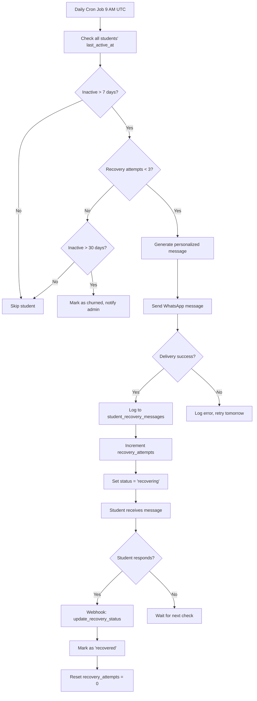
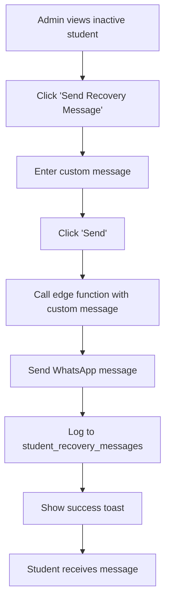

# Student Recovery System

**Status**: ✅ Complete | **Developed by**: [Core47.ai](https://core47.ai)

---

## Overview

The Student Recovery System automatically identifies inactive students and sends personalized re-engagement messages via WhatsApp. This reduces churn, improves completion rates, and helps students get back on track before they completely drop out.

---

## Purpose & Value

### Problem Solved
- **Student Dropout**: 40-60% of online students become inactive within first month
- **Manual Follow-up**: Manually tracking inactive students is time-consuming
- **Delayed Intervention**: By the time admins notice, student is already gone
- **Inconsistent Outreach**: Some inactive students get follow-up, others don't

### Business Value
- **Reduced Churn**: 20-30% of inactive students re-engage after automated outreach
- **Increased Revenue**: Recovered students = retained revenue
- **Reduced Support Load**: Automated system eliminates manual tracking
- **Better Analytics**: Track recovery success rates by cohort/lesson

### User Impact
- **Students**: Gentle reminder that someone cares, personalized support
- **Admins**: Proactive system catches issues before they escalate
- **Mentors**: Notified when their assigned students become inactive

---

## How It Works

### For Students

1. **Activity Tracking**: System tracks last login, video views, assignment submissions
2. **Inactivity Threshold**: If no activity for X days (configurable, default: 7 days), marked as "inactive"
3. **Automated Message**: System sends WhatsApp message:
   - Personalized with student name
   - Mentions last lesson they were on
   - Encourages them to continue
   - Provides support contact
4. **Re-engagement**: If student logs back in within 14 days → Marked as "recovered"
5. **Escalation**: If still inactive after 14 days → Admin notified for manual outreach

**Student Receives**:
```
Hi [Name]! 👋

We noticed you haven't been active on Growth OS for a few days. You were doing great on [Last Lesson]!

Is everything okay? Need help with anything?

We're here to support you. Reply to this message or login to continue your journey! 🚀

- Your Success Team
```

### For Admins

**Dashboard View**:
- **Recovery Analytics**: % of students recovered, average recovery time
- **Inactive List**: All currently inactive students with days inactive
- **Recovery History**: Past recovery attempts and outcomes
- **Manual Override**: Send custom recovery message

**Notifications**:
- Daily summary email: "5 students became inactive yesterday"
- Alert when recovery message fails to send
- Alert when student exceeds 14 days inactive (escalation)

---

## Technical Implementation

### Database Tables

| Table | Purpose | Key Columns |
|-------|---------|-------------|
| `users` | User records with activity tracking | `id`, `last_active_at`, `last_login_at` |
| `students` | Student records | `user_id`, `recovery_status`, `recovery_attempts` |
| `student_recovery_messages` | Log of recovery messages sent | `student_id`, `sent_at`, `message_type`, `responded` |

### Key Columns Explained

**`users.last_active_at`**:
- Updated on: Login, video view, assignment submission, message sent
- Used to calculate inactivity period
- Type: `TIMESTAMPTZ`

**`students.recovery_status`**:
- Values: `'active'`, `'inactive'`, `'recovering'`, `'recovered'`, `'churned'`
- `inactive`: No activity for 7+ days
- `recovering`: Recovery message sent, awaiting response
- `recovered`: Student re-engaged after recovery message
- `churned`: Inactive for 30+ days, considered lost

**`students.recovery_attempts`**:
- Count of recovery messages sent
- Max 3 attempts before marking as `churned`

**`student_recovery_messages` table**:
```sql
CREATE TABLE student_recovery_messages (
  id UUID PRIMARY KEY DEFAULT gen_random_uuid(),
  student_id UUID NOT NULL REFERENCES students(id) ON DELETE CASCADE,
  sent_at TIMESTAMPTZ DEFAULT now(),
  message_type TEXT NOT NULL, -- 'first_attempt', 'second_attempt', 'final_attempt'
  message_content TEXT NOT NULL,
  delivery_status TEXT DEFAULT 'pending', -- 'pending', 'delivered', 'failed'
  responded BOOLEAN DEFAULT false,
  responded_at TIMESTAMPTZ
);
```

---

### Functions

#### `check_student_recovery_status()`

**Purpose**: Identify students who need recovery outreach.

**Logic**:
1. Find all students with `last_active_at > 7 days ago`
2. Exclude students already marked as `churned`
3. Return list of student IDs that need recovery message

**Returns**: `TABLE(student_id UUID, days_inactive INTEGER)`

**Example**:
```sql
SELECT * FROM check_student_recovery_status();
-- Returns:
-- student_id | days_inactive
-- uuid-1     | 8
-- uuid-2     | 12
```

---

#### `update_student_activity(p_user_id UUID)`

**Purpose**: Update `last_active_at` timestamp when student does something.

**Called By**: 
- Login trigger
- Video view trigger
- Assignment submission trigger
- Message sent trigger

**Logic**:
1. Update `users.last_active_at = now()`
2. If `recovery_status = 'recovering'`, change to `'recovered'`
3. Reset `recovery_attempts = 0`

**Example**:
```sql
-- Automatically called on activity
SELECT update_student_activity('user-uuid');
```

---

### Edge Functions

#### `/daily-recovery-check`

**Purpose**: Daily cron job to identify and message inactive students.

**Trigger**: Supabase cron (runs at 9:00 AM UTC daily)

**Authentication**: Service role (bypasses RLS)

**Logic**:
1. Call `check_student_recovery_status()` to get inactive students
2. For each inactive student:
   - Check `recovery_attempts` count
   - If < 3 attempts:
     - Generate personalized WhatsApp message
     - Send via WhatsApp API (integrations table)
     - Log to `student_recovery_messages`
     - Increment `recovery_attempts`
     - Set `recovery_status = 'recovering'`
   - If >= 3 attempts and 30+ days inactive:
     - Mark as `churned`
     - Notify admin via email
3. Return summary: `{ checked: 150, messaged: 12, churned: 3 }`

**Request**:
```json
POST /functions/v1/daily-recovery-check
Authorization: Bearer <SERVICE_ROLE_KEY>
Content-Type: application/json

{}
```

**Response**:
```json
{
  "success": true,
  "students_checked": 150,
  "messages_sent": 12,
  "students_churned": 3,
  "errors": []
}
```

---

#### `/update-recovery-status`

**Purpose**: Webhook called when student responds to WhatsApp message.

**Trigger**: WhatsApp webhook on message received

**Authentication**: API key (configured in environment)

**Logic**:
1. Receive webhook with student phone number + message
2. Find student by phone number
3. Update `student_recovery_messages.responded = true`
4. Update `students.recovery_status = 'recovered'`
5. Send confirmation message: "Welcome back! Ready to continue?"

**Request**:
```json
POST /functions/v1/update-recovery-status
Content-Type: application/json
X-API-Key: <RECOVERY_API_KEY>

{
  "phone": "+1234567890",
  "message": "Yes, I'm back!",
  "timestamp": "2025-10-21T12:00:00Z"
}
```

**Response**:
```json
{
  "success": true,
  "student_id": "uuid-here",
  "new_status": "recovered"
}
```

---

### Frontend Components

#### `RecoveryManagement.tsx`

**Location**: `src/components/admin/RecoveryManagement.tsx`

**Features**:
- **Recovery Dashboard**: Shows inactive students, recovery rate, average recovery time
- **Inactive Student List**: Table of all inactive students with days inactive
- **Manual Message Button**: Admin can send custom recovery message
- **Recovery History**: Log of all recovery attempts

**Usage**:
```tsx
import RecoveryManagement from '@/components/admin/RecoveryManagement';

<RecoveryManagement />
```

---

### Hooks

#### `useRecoveryRate()`

**Location**: `src/hooks/useRecoveryRate.ts`

**Purpose**: Calculate recovery success rate.

**Returns**:
```typescript
{
  totalInactive: number;
  totalRecovered: number;
  recoveryRate: number; // percentage
  averageRecoveryDays: number;
  isLoading: boolean;
}
```

**Example**:
```tsx
const { recoveryRate, averageRecoveryDays } = useRecoveryRate();

<p>Recovery Rate: {recoveryRate}%</p>
<p>Avg Recovery Time: {averageRecoveryDays} days</p>
```

---

#### `useRealRecoveryRate()`

**Location**: `src/hooks/useRealRecoveryRate.ts`

**Purpose**: Real-time recovery metrics (includes today's data).

**Returns**:
```typescript
{
  currentlyInactive: number;
  messagesLastWeek: number;
  recoveredLastWeek: number;
  churnedLastWeek: number;
}
```

---

## Configuration

### Environment Variables

```env
# Recovery system settings
VITE_RECOVERY_ENABLED=true
VITE_INACTIVITY_THRESHOLD_DAYS=7
VITE_RECOVERY_MAX_ATTEMPTS=3
VITE_CHURN_THRESHOLD_DAYS=30

# WhatsApp integration
VITE_WHATSAPP_API_KEY=<your-api-key>
VITE_WHATSAPP_PHONE_NUMBER=<business-number>

# Cron schedule (UTC)
RECOVERY_CHECK_CRON_SCHEDULE=0 9 * * *  # Daily at 9 AM UTC
```

### Database Settings

**Configure inactivity threshold** (via `company_settings`):
```sql
UPDATE company_settings 
SET settings = jsonb_set(
  COALESCE(settings, '{}'::jsonb), 
  '{recovery_inactivity_days}', 
  '7'::jsonb
);
```

**Configure recovery message template**:
```sql
UPDATE company_settings 
SET settings = jsonb_set(
  COALESCE(settings, '{}'::jsonb), 
  '{recovery_message_template}', 
  '"Hi {name}! We noticed you haven''t been active for a few days. Need help? We''re here!"'::jsonb
);
```

---

## Workflows

### Automated Recovery Flow



### Manual Admin Recovery



---

## Access Control

### RLS Policies

**`student_recovery_messages` table**:

1. **`recovery_messages_select_admin`** - Admins view all messages
   ```sql
   CREATE POLICY "recovery_messages_select_admin" 
   ON student_recovery_messages
   FOR SELECT USING (
     get_current_user_role() IN ('admin', 'superadmin')
   );
   ```

2. **`recovery_messages_insert_system`** - Only system can insert
   ```sql
   CREATE POLICY "recovery_messages_insert_system" 
   ON student_recovery_messages
   FOR INSERT WITH CHECK (false);
   -- Only edge functions (service role) can insert
   ```

### Role Permissions

| Role | View Recovery Data | Send Messages | Configure Settings | View Analytics |
|------|-------------------|---------------|-------------------|---------------|
| Student | ❌ | ❌ | ❌ | ❌ |
| Mentor | Assigned students only | ❌ | ❌ | Assigned students |
| Enrollment Manager | All students | ❌ | ❌ | All students |
| Admin | All students | ✅ | ✅ | All students |
| Superadmin | All students | ✅ | ✅ | All students |

---

## Integration Points

### Integrates With

- **WhatsApp API**: Sends recovery messages
- **Activity Logging**: Tracks when `last_active_at` updates
- **Notification System**: Alerts admins of churn risk
- **Student Management**: Updates student status
- **Analytics Dashboard**: Shows recovery metrics

### Triggers

**System Tracks Activity From**:
- Login events
- Video views (`recording_views` table)
- Assignment submissions (`submissions` table)
- Messages sent (`messages` table)
- Support ticket creation

**Updates**:
```sql
-- Trigger on video view
CREATE TRIGGER update_activity_on_video_view
AFTER INSERT ON recording_views
FOR EACH ROW
EXECUTE FUNCTION update_student_activity();
```

### Events Emitted

- `student_inactive`: When student crosses inactivity threshold
- `recovery_message_sent`: When WhatsApp message sent
- `student_recovered`: When student re-engages
- `student_churned`: When student marked as churned (30+ days inactive)

---

## Troubleshooting

### Common Issues

#### **Issue**: Recovery messages not being sent

**Possible Causes**:
1. Cron job not running
2. WhatsApp API credentials invalid
3. Student has no phone number in `students` table
4. Edge function authentication failing

**Solution**:
```sql
-- Check recent cron job runs (Supabase Dashboard → Edge Functions → Logs)
-- Manually trigger recovery check:
SELECT * FROM check_student_recovery_status();

-- Verify WhatsApp credentials
SELECT * FROM integrations WHERE integration_type = 'whatsapp';

-- Check students without phone numbers
SELECT COUNT(*) FROM students WHERE phone_number IS NULL;
```

---

#### **Issue**: Student marked as inactive but was recently active

**Possible Causes**:
1. `last_active_at` not being updated
2. Trigger on activity events not firing
3. Timezone mismatch (UTC vs local)

**Solution**:
```sql
-- Check student's last activity
SELECT 
  full_name,
  last_active_at,
  last_login_at,
  EXTRACT(DAY FROM (now() - last_active_at)) AS days_inactive
FROM users
WHERE id = 'user-uuid';

-- Manually update last_active_at
UPDATE users 
SET last_active_at = now() 
WHERE id = 'user-uuid';

-- Check if triggers are enabled
SELECT tgname, tgenabled 
FROM pg_trigger 
WHERE tgname LIKE '%activity%';
```

---

#### **Issue**: Recovery rate showing 0%

**Possible Causes**:
1. No students have been marked as `recovered` yet
2. `responded` column not being updated on WhatsApp response
3. Webhook not configured correctly

**Solution**:
```sql
-- Check recovery message responses
SELECT 
  COUNT(*) AS total_messages,
  COUNT(*) FILTER (WHERE responded = true) AS responded_count
FROM student_recovery_messages;

-- Manually mark student as recovered
UPDATE students 
SET recovery_status = 'recovered' 
WHERE user_id = 'user-uuid';

-- Test webhook endpoint
-- POST to /functions/v1/update-recovery-status with test data
```

---

### Debug Queries

#### View all inactive students
```sql
SELECT 
  u.full_name,
  u.email,
  s.phone_number,
  u.last_active_at,
  EXTRACT(DAY FROM (now() - u.last_active_at)) AS days_inactive,
  s.recovery_status,
  s.recovery_attempts
FROM users u
JOIN students s ON s.user_id = u.id
WHERE u.last_active_at < now() - INTERVAL '7 days'
  AND s.recovery_status != 'churned'
ORDER BY u.last_active_at ASC;
```

#### Recovery analytics
```sql
SELECT 
  recovery_status,
  COUNT(*) AS student_count,
  AVG(recovery_attempts) AS avg_attempts
FROM students
WHERE recovery_status IN ('inactive', 'recovering', 'recovered', 'churned')
GROUP BY recovery_status;
```

#### Recent recovery messages
```sql
SELECT 
  u.full_name,
  srm.sent_at,
  srm.message_type,
  srm.delivery_status,
  srm.responded
FROM student_recovery_messages srm
JOIN students s ON s.id = srm.student_id
JOIN users u ON u.id = s.user_id
ORDER BY srm.sent_at DESC
LIMIT 20;
```

---

## API Reference

### Edge Function: `daily-recovery-check`

**Endpoint**: `POST /functions/v1/daily-recovery-check`

**Authentication**: Service role (Bearer token)

**Request**: Empty body `{}`

**Response**:
```json
{
  "success": true,
  "students_checked": 150,
  "messages_sent": 12,
  "students_churned": 3,
  "errors": []
}
```

---

### Edge Function: `update-recovery-status`

**Endpoint**: `POST /functions/v1/update-recovery-status`

**Authentication**: API key header `X-API-Key`

**Request**:
```json
{
  "phone": "+1234567890",
  "message": "Yes, I'm ready to continue!",
  "timestamp": "2025-10-21T12:00:00Z"
}
```

**Response**:
```json
{
  "success": true,
  "student_id": "uuid-here",
  "new_status": "recovered",
  "message": "Student marked as recovered"
}
```

---

## Future Enhancements

### Planned Features (v2.1)

- **SMS Fallback**: If WhatsApp fails, send SMS
- **Multi-channel**: Email + WhatsApp + SMS for maximum reach
- **A/B Testing**: Test different message templates to optimize recovery rate
- **Mentor Assignment**: Auto-assign mentor to reach out personally
- **Smart Timing**: Send messages at optimal time for each student (based on past activity patterns)
- **Escalation Path**: Auto-schedule call with student after 3 failed attempts

---

## Support

For issues with student recovery system:

1. Check [Troubleshooting](#troubleshooting) section above
2. Verify WhatsApp API credentials in `integrations` table
3. Check Supabase Edge Function logs
4. Contact: [support@core47.ai](mailto:support@core47.ai)

---

**Developed by Core47.ai** - © 2025 Core47.ai. All rights reserved.  
**Website**: [core47.ai](https://core47.ai) | **Support**: [support@core47.ai](mailto:support@core47.ai)
