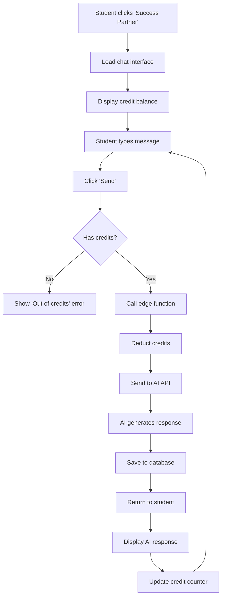
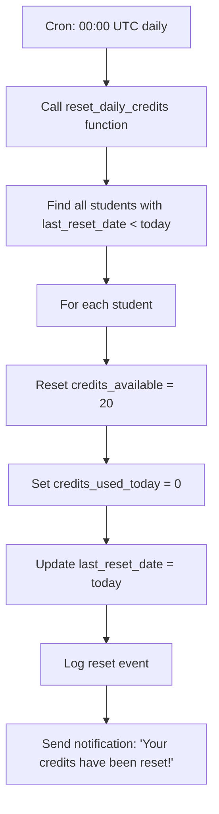

# Success Partner AI

**Status**: ✅ Complete | **Developed by**: [Core47.ai](https://core47.ai)

---

## Overview

Success Partner AI provides 24/7 AI-powered chat support to students. It answers questions about course content, provides motivation, offers study tips, and helps students overcome obstacles. The system uses a credit-based model to manage costs while ensuring all students have access to AI support.

---

## Purpose & Value

### Problem Solved
- **Limited Mentor Availability**: Mentors can't be online 24/7
- **Delayed Responses**: Students wait hours/days for answers to simple questions
- **Scalability**: One mentor can only help limited number of students simultaneously
- **Repetitive Questions**: Mentors answer same questions repeatedly

### Business Value
- **Reduced Support Load**: AI handles 60-80% of routine questions
- **Improved Retention**: Instant support = fewer dropouts
- **Scalability**: Support unlimited students without hiring more mentors
- **Cost Effective**: $0.10 per AI conversation vs. $20+ per mentor hour

### User Impact
- **Students**: Instant answers anytime, personalized support, no judgment
- **Mentors**: Focus on high-value interactions (assignments, complex issues)
- **Admins**: Analytics on common student pain points

---

## How It Works

### For Students

1. **Access Chat**: Click "Success Partner" button in student dashboard
2. **Ask Question**: Type question about course, assignments, or need motivation
3. **AI Response**: Receive instant, contextual response
4. **Credit Deduction**: Each message costs credits (students get free daily credits)
5. **Credit Limits**: 
   - Free: 20 credits/day (resets at midnight UTC)
   - Paid plans: Unlimited or custom limits

**Example Conversation**:
```
Student: I'm stuck on the Facebook Ads module. How do I set up a pixel?

Success Partner: Great question! The Facebook Pixel is a tracking code that...
[provides step-by-step instructions]

Would you like me to explain how to verify it's working correctly?

Student: Yes please!

Success Partner: Sure! Here's how to verify your pixel installation...
```

**Credit Usage**:
- Simple question: 1 credit
- Follow-up: 1 credit
- Complex query with context: 2 credits

### For Admins

**Features**:
- **Credit Management**: Set credit limits per student or plan
- **Usage Analytics**: View total credits used, most active students
- **Conversation Review**: Read past AI conversations (privacy-aware)
- **AI Configuration**: Customize AI personality, knowledge base, response length
- **Cost Tracking**: Monitor AI API costs

**Dashboard Metrics**:
- Total conversations today/week/month
- Average credits per student
- Most common question topics
- AI response quality (thumbs up/down from students)

---

## Technical Implementation

### Database Tables

| Table | Purpose | Key Columns |
|-------|---------|-------------|
| `success_partner_credits` | Track credits per student | `student_id`, `credits_available`, `last_reset_date` |
| `messages` | Chat messages (student + AI) | `user_id`, `content`, `sender_type`, `credits_used` |
| `company_settings` | AI configuration | `settings.success_partner_config` (JSON) |

### Key Columns Explained

**`success_partner_credits` table**:
```sql
CREATE TABLE success_partner_credits (
  id UUID PRIMARY KEY DEFAULT gen_random_uuid(),
  student_id UUID NOT NULL REFERENCES students(id) ON DELETE CASCADE,
  credits_available INTEGER NOT NULL DEFAULT 20,
  credits_used_today INTEGER DEFAULT 0,
  last_reset_date DATE DEFAULT CURRENT_DATE,
  total_credits_used INTEGER DEFAULT 0,
  UNIQUE(student_id)
);
```

**`messages` table** (relevant columns):
```sql
CREATE TABLE messages (
  id UUID PRIMARY KEY DEFAULT gen_random_uuid(),
  user_id UUID NOT NULL REFERENCES users(id),
  content TEXT NOT NULL,
  sender_type TEXT NOT NULL, -- 'student', 'success_partner', 'mentor', 'admin'
  credits_used INTEGER DEFAULT 0,
  created_at TIMESTAMPTZ DEFAULT now(),
  conversation_id UUID, -- Groups related messages
  metadata JSONB -- AI model used, tokens consumed, etc.
);
```

**`company_settings.settings.success_partner_config`**:
```json
{
  "enabled": true,
  "daily_free_credits": 20,
  "credit_reset_time_utc": "00:00",
  "ai_model": "gpt-4o-mini",
  "max_response_tokens": 500,
  "personality": "friendly, supportive, encouraging",
  "knowledge_base_urls": ["https://docs.example.com"],
  "forbidden_topics": ["personal advice", "medical", "legal"]
}
```

---

### Functions

#### `get_student_credits(p_student_id UUID)`

**Purpose**: Get current available credits for a student.

**Logic**:
1. Check if credits record exists for student
2. If `last_reset_date` is yesterday or earlier:
   - Reset `credits_available` to daily limit
   - Set `credits_used_today = 0`
   - Update `last_reset_date = CURRENT_DATE`
3. Return `credits_available`

**Returns**: `INTEGER`

**Example**:
```sql
SELECT get_student_credits('student-uuid');
-- Returns: 15 (if they have 15 credits left today)
```

---

#### `deduct_sp_credits(p_student_id UUID, p_credits INTEGER)`

**Purpose**: Deduct credits when student sends message to AI.

**Logic**:
1. Call `get_student_credits()` to ensure reset has happened
2. Check if `credits_available >= p_credits`
3. If yes:
   - `credits_available = credits_available - p_credits`
   - `credits_used_today = credits_used_today + p_credits`
   - `total_credits_used = total_credits_used + p_credits`
   - Return `true`
4. If no:
   - Return `false` (insufficient credits)

**Returns**: `BOOLEAN`

**Example**:
```sql
SELECT deduct_sp_credits('student-uuid', 2);
-- Returns: true (if credits were deducted) or false (if insufficient)
```

---

#### `reset_daily_credits()`

**Purpose**: Cron job function to reset all students' daily credits at midnight UTC.

**Logic**:
1. Find all students with `last_reset_date < CURRENT_DATE`
2. For each:
   - `credits_available = daily_free_credits`
   - `credits_used_today = 0`
   - `last_reset_date = CURRENT_DATE`

**Called By**: Supabase cron (daily at 00:00 UTC)

**Example**:
```sql
-- Runs automatically via cron
SELECT reset_daily_credits();
```

---

### Edge Functions

#### `/process-success-partner-message`

**Purpose**: Handle student message, call AI, return response, deduct credits.

**Authentication**: User JWT (Bearer token)

**Logic**:
1. Authenticate student
2. Get student's available credits
3. If credits < 1: Return error "Out of credits"
4. Fetch recent conversation history (last 10 messages)
5. Build AI prompt with:
   - System prompt (from `company_settings`)
   - Conversation history
   - New student message
6. Call OpenAI API (or configured AI provider)
7. Deduct credits (1-2 depending on complexity)
8. Save AI response to `messages` table
9. Return AI response to student

**Request**:
```json
POST /functions/v1/process-success-partner-message
Authorization: Bearer <USER_JWT>
Content-Type: application/json

{
  "message": "How do I create a Facebook ad campaign?",
  "conversation_id": "uuid-here" // optional, for threading
}
```

**Response**:
```json
{
  "success": true,
  "response": "Great question! To create a Facebook ad campaign...",
  "credits_used": 2,
  "credits_remaining": 18,
  "conversation_id": "uuid-here",
  "metadata": {
    "model": "gpt-4o-mini",
    "tokens_used": 450
  }
}
```

**Error Response** (out of credits):
```json
{
  "success": false,
  "error": "insufficient_credits",
  "message": "You've used all your daily credits. They'll reset tomorrow at midnight UTC.",
  "credits_remaining": 0,
  "next_reset": "2025-10-22T00:00:00Z"
}
```

---

#### `/success-partner-credits`

**Purpose**: Get student's current credit balance.

**Authentication**: User JWT (Bearer token)

**Request**:
```json
GET /functions/v1/success-partner-credits
Authorization: Bearer <USER_JWT>
```

**Response**:
```json
{
  "success": true,
  "credits_available": 15,
  "credits_used_today": 5,
  "daily_limit": 20,
  "next_reset": "2025-10-22T00:00:00Z",
  "total_credits_used": 150
}
```

---

### Frontend Components

#### `SuccessPartner.tsx`

**Location**: `src/components/SuccessPartner.tsx`

**Features**:
- Chat interface (messages list + input)
- Credit counter (shows remaining credits)
- Typing indicator when AI is responding
- Error handling (out of credits, API failure)
- Conversation threading

**Usage**:
```tsx
import SuccessPartner from '@/components/SuccessPartner';

// In student dashboard
<SuccessPartner />
```

---

### Hooks

#### `useSuccessPartnerChat()`

**Location**: Custom hook in `SuccessPartner.tsx` component

**Purpose**: Manage chat state, send messages, handle credits.

**Returns**:
```typescript
{
  messages: Message[];
  credits: number;
  sendMessage: (message: string) => Promise<void>;
  isLoading: boolean;
  error: string | null;
}
```

**Example**:
```tsx
const { messages, credits, sendMessage, isLoading } = useSuccessPartnerChat();

<p>Credits remaining: {credits}</p>
<button onClick={() => sendMessage("Help me!")} disabled={isLoading}>
  Send
</button>
```

---

## Configuration

### Environment Variables

```env
# Enable/disable Success Partner AI
VITE_SUCCESS_PARTNER_ENABLED=true

# Daily free credits
VITE_SUCCESS_PARTNER_DAILY_CREDITS=20

# AI Model (OpenAI)
VITE_AI_MODEL=gpt-4o-mini
VITE_OPENAI_API_KEY=<secret>

# Or use Lovable AI Gateway
VITE_USE_LOVABLE_AI=true
LOVABLE_API_KEY=<secret>
```

### Database Settings

**Configure via `company_settings.settings`**:
```sql
UPDATE company_settings 
SET settings = jsonb_set(
  COALESCE(settings, '{}'::jsonb), 
  '{success_partner_config}', 
  '{
    "enabled": true,
    "daily_free_credits": 20,
    "ai_model": "gpt-4o-mini",
    "personality": "friendly, supportive, encouraging",
    "max_response_tokens": 500
  }'::jsonb
);
```

**Set custom credit limit for specific student**:
```sql
UPDATE success_partner_credits 
SET credits_available = 50 
WHERE student_id = 'student-uuid';
```

---

## Workflows

### Student Chat Flow



### Daily Credit Reset Flow



---

## Access Control

### RLS Policies

**`success_partner_credits` table**:

1. **`sp_credits_select_own`** - Students view their own credits
   ```sql
   CREATE POLICY "sp_credits_select_own" 
   ON success_partner_credits
   FOR SELECT USING (
     student_id IN (SELECT id FROM students WHERE user_id = auth.uid())
   );
   ```

2. **`sp_credits_select_admin`** - Admins view all credits
   ```sql
   CREATE POLICY "sp_credits_select_admin" 
   ON success_partner_credits
   FOR SELECT USING (
     get_current_user_role() IN ('admin', 'superadmin')
   );
   ```

3. **`sp_credits_update_system`** - Only system updates credits
   ```sql
   CREATE POLICY "sp_credits_update_system" 
   ON success_partner_credits
   FOR UPDATE USING (false);
   -- Only edge functions (service role) can update
   ```

### Role Permissions

| Role | View Credits | Use AI Chat | View Conversations | Configure AI |
|------|--------------|-------------|-------------------|--------------|
| Student | Own only | ✅ | Own only | ❌ |
| Mentor | Assigned students | ❌ | Assigned students | ❌ |
| Enrollment Manager | All students | ❌ | ❌ | ❌ |
| Admin | All students | ✅ (testing) | All students | ✅ |
| Superadmin | All students | ✅ | All students | ✅ |

---

## Integration Points

### Integrates With

- **OpenAI API** (or Lovable AI Gateway): Generates AI responses
- **Messages System**: Stores all chat messages
- **Notifications**: Alerts student when credits reset
- **Student Dashboard**: Displays Success Partner button
- **Analytics**: Tracks usage patterns

### Triggers

**Credit Reset Triggered By**:
- Daily cron job at 00:00 UTC

**AI Response Triggered By**:
- Student sending message via chat interface

### Events Emitted

- `sp_message_sent`: When student sends message
- `sp_credits_deducted`: When credits are deducted
- `sp_credits_reset`: When daily credits reset
- `sp_out_of_credits`: When student attempts to use AI without credits

---

## Troubleshooting

### Common Issues

#### **Issue**: Student says AI not responding

**Possible Causes**:
1. Out of credits
2. OpenAI API key invalid or rate limited
3. Edge function timeout
4. Network issue

**Solution**:
```sql
-- Check student's credits
SELECT * FROM success_partner_credits 
WHERE student_id = 'student-uuid';

-- Check recent messages
SELECT * FROM messages 
WHERE user_id = 'user-uuid' 
ORDER BY created_at DESC 
LIMIT 10;

-- Manually add credits
UPDATE success_partner_credits 
SET credits_available = 20 
WHERE student_id = 'student-uuid';

-- Check edge function logs (Supabase Dashboard)
```

---

#### **Issue**: Credits not resetting daily

**Possible Causes**:
1. Cron job not running
2. `last_reset_date` stuck in past
3. `reset_daily_credits()` function error

**Solution**:
```sql
-- Manually trigger reset
SELECT reset_daily_credits();

-- Check cron job status (Supabase Dashboard → Edge Functions → Cron)

-- Force reset for specific student
UPDATE success_partner_credits 
SET 
  credits_available = 20,
  credits_used_today = 0,
  last_reset_date = CURRENT_DATE
WHERE student_id = 'student-uuid';
```

---

#### **Issue**: AI responses are irrelevant or unhelpful

**Possible Causes**:
1. System prompt not optimized
2. AI model not suitable (e.g., using too cheap a model)
3. Conversation history too long (context overflow)

**Solution**:
```sql
-- Update AI configuration
UPDATE company_settings 
SET settings = jsonb_set(
  settings, 
  '{success_partner_config, personality}', 
  '"You are a knowledgeable e-commerce mentor. Provide actionable, step-by-step advice."'::jsonb
);

-- Switch to better model
UPDATE company_settings 
SET settings = jsonb_set(
  settings, 
  '{success_partner_config, ai_model}', 
  '"gpt-4o"'::jsonb
);
```

---

### Debug Queries

#### View students with low credits
```sql
SELECT 
  u.full_name,
  u.email,
  spc.credits_available,
  spc.credits_used_today,
  spc.total_credits_used
FROM success_partner_credits spc
JOIN students s ON s.id = spc.student_id
JOIN users u ON u.id = s.user_id
WHERE spc.credits_available < 5
ORDER BY spc.credits_available ASC;
```

#### Most active AI users
```sql
SELECT 
  u.full_name,
  COUNT(*) AS messages_sent,
  SUM(m.credits_used) AS total_credits_used
FROM messages m
JOIN users u ON u.id = m.user_id
WHERE m.sender_type = 'student'
  AND m.created_at > now() - INTERVAL '7 days'
GROUP BY u.id, u.full_name
ORDER BY total_credits_used DESC
LIMIT 10;
```

#### Recent AI conversations
```sql
SELECT 
  u.full_name,
  m.content,
  m.sender_type,
  m.credits_used,
  m.created_at
FROM messages m
JOIN users u ON u.id = m.user_id
WHERE m.conversation_id = 'conversation-uuid'
ORDER BY m.created_at ASC;
```

---

## API Reference

### Edge Function: `process-success-partner-message`

**Endpoint**: `POST /functions/v1/process-success-partner-message`

**Authentication**: Bearer token (user JWT)

**Request**:
```json
{
  "message": "How do I set up a Facebook pixel?",
  "conversation_id": "optional-uuid-for-threading"
}
```

**Response**:
```json
{
  "success": true,
  "response": "Great question! To set up a Facebook pixel...",
  "credits_used": 2,
  "credits_remaining": 18,
  "conversation_id": "uuid-here"
}
```

---

### Edge Function: `success-partner-credits`

**Endpoint**: `GET /functions/v1/success-partner-credits`

**Authentication**: Bearer token (user JWT)

**Response**:
```json
{
  "success": true,
  "credits_available": 15,
  "credits_used_today": 5,
  "daily_limit": 20,
  "next_reset": "2025-10-22T00:00:00Z"
}
```

---

## Future Enhancements

### Planned Features (v2.1)

- **Voice Input**: Students speak questions instead of typing
- **Image Analysis**: AI can analyze screenshots of student's issues
- **Lesson Context**: AI automatically knows which lesson student is on
- **Assignment Help**: AI provides hints without giving away answers
- **Study Plans**: AI generates personalized study schedules
- **Multilingual**: Support for multiple languages

---

## Support

For issues with Success Partner AI:

1. Check [Troubleshooting](#troubleshooting) section above
2. Verify OpenAI API key in environment variables
3. Check Supabase Edge Function logs
4. Contact: [support@core47.ai](mailto:support@core47.ai)

---

**Developed by Core47.ai** - © 2025 Core47.ai. All rights reserved.  
**Website**: [core47.ai](https://core47.ai) | **Support**: [support@core47.ai](mailto:support@core47.ai)
